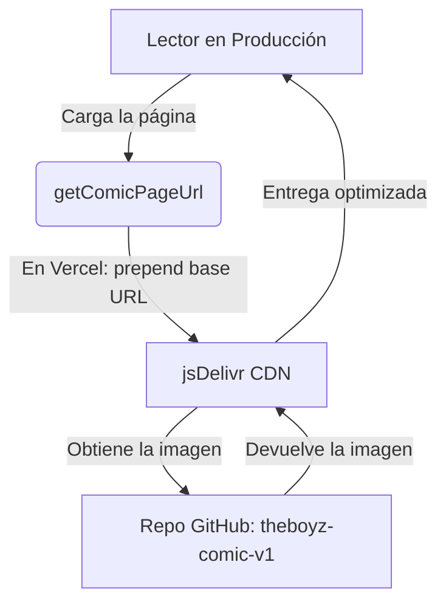

# ⚡ THE BOYS COMIC WEB READER & EDITOR

Un lector de cómics web interactivo, ultra-dinámico y con estética de cómic Pop-Art/Sci-Fi duro, desarrollado con **Next.js** (App Router y Turbopack) y **Framer Motion**. Incluye un editor visual interactivo integrado para maquetar viñetas, globos de diálogo y trayectorias de cámara cinemática.

---

## 🎨 Características Core

### 📖 Lector Cinemático Inteligente
- **Lectura Guiada (Cinematic Zoom)**: Transiciones suaves de cámara de viñeta a viñeta siguiendo las posiciones definidas (`focusY`, `zoomRects` y escalas).
- **Control de Paneo y Zoom**: Pellizcar para hacer zoom (pinch-to-zoom) en dispositivos móviles, usar la rueda del mouse en escritorio o controles pop-art flotantes para explorar las páginas de forma libre sin interrumpir el flujo de viñetas.
- **Spoiler Masking**: Máscaras automáticas en las siguientes viñetas de la página para evitar revelar partes de la historia antes de que el lector las alcance.
- **Acceso Protegido por Contraseña**: Sistema para resguardar borradores y acceder al panel de edición.

### ✍️ Editor de Diálogos Visual e Interactivo
- **Arrastrar y Posicionar (Drag-and-Drop)**: Mueve los globos libremente sobre el lienzo de la página. El sistema convierte automáticamente las coordenadas de pantalla a porcentajes relativos de la imagen, garantizando que el diseño sea responsivo.
- **Cola Elástica Inteligente (Elastic Tail)**: Genera y edita curvas de Bézier mediante nodos de arrastre para dirigir la cola del globo exactamente al personaje que habla.
- **Ajuste a Rejilla (Snap-to-Grid)**: Cuadrícula visual dinámica con tamaño de celda configurable para lograr una alineación perfecta de las viñetas y diálogos.
- **Pestaña de Paradas Cinemáticas (Camera Stops)**: Define las secuencias de zoom del lector, ajusta el foco del scroll y establece rectángulos de zoom principal o secundario (máscaras de spoiler).
- **Personalización Completa**: Modifica en tiempo real el texto, orador, fuentes temáticas, colores personalizados de fondo/borde, redondeado, tamaño de fuente y ancho de burbuja.

### 👤 Roster de Personajes y Sección Interactiva
- **Hero Section 3D**: Portadas y personajes que asoman responsivamente siguiendo el movimiento del cursor.
- **Filtros de Spoilers**: Los personajes que aún no aparecen en el progreso de la lectura del usuario se bloquean en modo incógnito (escala de grises y desenfoque) con alertas de spoiler dinámicas.
- **Epic Transitions**: Animaciones fluidas inspiradas en interfaces de ciencia ficción y efectos HUD al abrir las fichas técnicas y estadísticas de personajes.

---

## 📂 Arquitectura Modular

El proyecto está diseñado bajo un enfoque modular y limpio, asegurando que ningún componente supere el límite óptimo de 500-600 líneas de código:

### 🏠 Home & Ficha de Personajes (`/components/home`)
- [CharacterModal.tsx](file:///d:/.CodeProjects/the-boys/components/home/CharacterModal.tsx): Contenedor base de la ficha del personaje.
  - [ImageLightbox.tsx](file:///d:/.CodeProjects/the-boys/components/home/CharacterModal/ImageLightbox.tsx): Visualizador a pantalla completa de ilustraciones en alta resolución.
  - [EpicTransitionOverlay.tsx](file:///d:/.CodeProjects/the-boys/components/home/CharacterModal/EpicTransitionOverlay.tsx): Overlay HUD sci-fi para las transiciones.
  - [CharacterInfoPanel.tsx](file:///d:/.CodeProjects/the-boys/components/home/CharacterModal/CharacterInfoPanel.tsx): Panel de estadísticas, bio e interruptores de spoilers.

### 📖 Lector & Editor de Diálogos (`/components/reader`)
- [CinematicReader.tsx](file:///d:/.CodeProjects/the-boys/components/reader/CinematicReader.tsx): Orquestador principal de estados, eventos del teclado, guardado de datos y sincronización API.
- [ReaderCanvas.tsx](file:///d:/.CodeProjects/the-boys/components/reader/ReaderCanvas.tsx): El espacio de trabajo interactivo izquierdo que renderiza la página activa, rejillas, guías cinemáticas y máscaras de spoiler.
- **Globos de Diálogo (`/components/reader/bubbles`)**:
  - [DialogueBubble.tsx](file:///d:/.CodeProjects/the-boys/components/reader/DialogueBubble.tsx): Despachador principal que gestiona el renderizado condicional de burbujas según su estilo.
  - [CaptionBubble.tsx](file:///d:/.CodeProjects/the-boys/components/reader/bubbles/CaptionBubble.tsx): Bloques rectangulares de narrador con soporte para colores de orador.
  - [ThoughtBubble.tsx](file:///d:/.CodeProjects/the-boys/components/reader/bubbles/ThoughtBubble.tsx): Globos en forma de nube (pensamiento) con burbujas de anclaje.
  - [StandardBubble.tsx](file:///d:/.CodeProjects/the-boys/components/reader/bubbles/StandardBubble.tsx): Soporta múltiples variantes: normal, gritos (bordes picudos y sombras pop-art), susurros (líneas punteadas), electrónica (estilo neón digital) y efectos SFX (título rotado con sombras de impacto).
- **Panel de Edición (`/components/reader/editor`)**:
  - [DialogueEditorPanel.tsx](file:///d:/.CodeProjects/the-boys/components/reader/DialogueEditorPanel.tsx): Sidebar de navegación del editor.
  - [EditorTabPanels.tsx](file:///d:/.CodeProjects/the-boys/components/reader/EditorTabPanels.tsx): Creación y reordenado de paradas cinemáticas y zoomRects.
  - [EditorTabDialogues.tsx](file:///d:/.CodeProjects/the-boys/components/reader/EditorTabDialogues.tsx): Edición geométrica y semántica de los globos.
    - [EditorBubbleVisualsForm.tsx](file:///d:/.CodeProjects/the-boys/components/reader/editor/EditorBubbleVisualsForm.tsx): Estilos, tipografías y colores.
    - [EditorBubbleLayoutForm.tsx](file:///d:/.CodeProjects/the-boys/components/reader/editor/EditorBubbleLayoutForm.tsx): Texto, dimensiones y alineación.
    - [EditorBubbleTailForm.tsx](file:///d:/.CodeProjects/the-boys/components/reader/editor/EditorBubbleTailForm.tsx): Controles de cola y Bézier elástico.
  - [EditorTabSettings.tsx](file:///d:/.CodeProjects/the-boys/components/reader/EditorTabSettings.tsx): Ajustes de rejilla y animaciones de página.

---

## 🛠️ Desarrollo Local

1. Instalar dependencias:
   ```bash
   npm install
   ```
2. Correr el servidor de desarrollo en modo Turbopack (altamente recomendado):
   ```bash
   npm run dev
   ```
3. Ejecutar compilación y análisis estático de TypeScript:
   ```bash
   npm run build
   ```

---

## 📦 Arquitectura de Almacenamiento e Integración CDN (jsDelivr)

**Sí, estamos usando jsDelivr en producción.** jsDelivr es un CDN público gratuito que permite cargar archivos directamente desde repositorios de GitHub sin límites de transferencia.

### ¿Cómo funciona este sistema?



### 🌐 Repositorios Separados

1. **Repositorio de la Web (`the-boys`)**: Contiene el código Next.js y los archivos de diálogos `dialogues.json`. Las imágenes aquí son marcadores de **0 bytes** para que la API de Next.js sepa que existen, sin ocupar espacio.
2. **Repositorio de Assets (`theboyz-comic-v1`)**: Contiene las imágenes `.webp` reales del cómic en alta definición.

---

### 🚀 ¿Cómo se conectan? (Flujo Local vs Producción)

Utilizamos la variable de entorno `NEXT_PUBLIC_ASSETS_BASE_URL` para configurar de dónde carga el lector las imágenes según el entorno:

#### 1. Modo Desarrollo (Localhost)
Para editar los diálogos en localhost con **cero retraso de caché**:
1. Entra a la carpeta de assets (`the-boyz-comic`) y levanta el servidor local:
   ```bash
   npm run dev
   ```
   *(Sirve las imágenes reales en `http://localhost:8080`)*
2. En tu `.env.local` de la aplicación principal (`the-boys`), configura:
   ```env
   NEXT_PUBLIC_ASSETS_BASE_URL="http://localhost:8080"
   ```
3. El editor leerá los nombres de las páginas desde el proyecto local (archivos marcadores de 0 bytes) pero cargará la imagen real desde tu servidor local en el puerto 8080.

#### 2. Modo Producción (Vercel + jsDelivr)
En producción, el lector cargará los archivos directamente del CDN de **jsDelivr**:
1. En el panel de **Vercel**, configura la variable de entorno:
   ```env
   NEXT_PUBLIC_ASSETS_BASE_URL="https://cdn.jsdelivr.net/gh/Ian9Franco/theboyz-comic-v1@main"
   ```
2. Cuando el usuario abre una página del cómic (ej. `/comics/saga/chapter/1.webp`), la aplicación la convierte en:
   `https://cdn.jsdelivr.net/gh/Ian9Franco/theboyz-comic-v1@main/comics/saga/chapter/1.webp`
3. Esto permite cargar las imágenes de manera global e ilimitada a **coste $0** sin consumir transferencia ni almacenamiento de Vercel.


