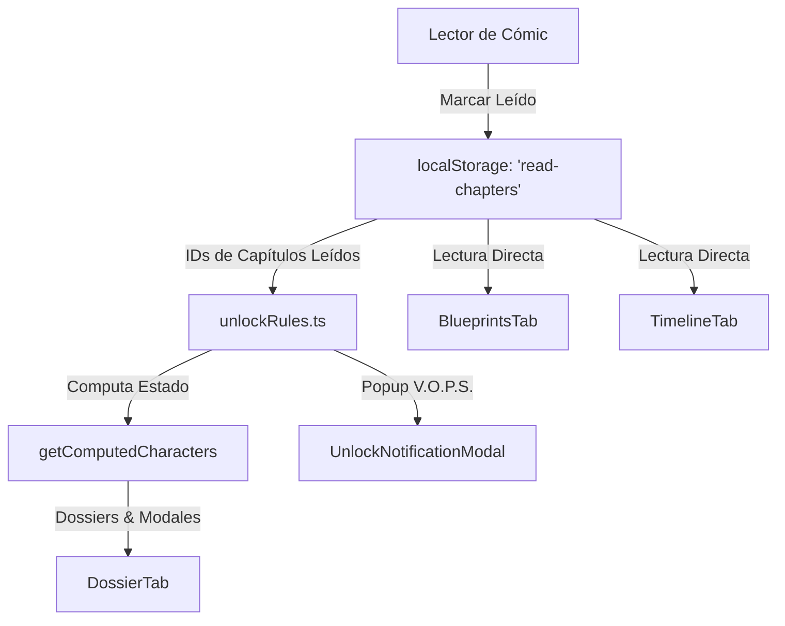

# 🔑 Guía de Configuración de Desbloqueos

Esta guía detalla el procedimiento técnico para hacer que personajes, esquemas tecnológicos (blueprints) o hitos cronológicos (timeline) se desbloqueen automáticamente tras finalizar la lectura de un nuevo cómic en **Elseframe Comics**.

---

## 🛠️ 1. Flujo de Datos del Desbloqueo

El sistema de desbloqueos se basa en la persistencia del cliente (`localStorage`) y en la comparación de reglas estáticas:



---

## 📦 2. Procedimiento Técnico paso a paso

### Paso A: Registrar el ID del Capítulo
El ID del capítulo se define en el archivo `chapter.json` dentro de su carpeta en `public/comics/`. Por ejemplo:
```json
{
  "id": "mi-nuevo-comic",
  "title": "Mi Nuevo Cómic"
}
```
*Asegúrate de que este ID sea exactamente el mismo que se utiliza en la ruta de archivos.*

---

### Paso B: Vincular Desbloqueo de Personajes
Edita el archivo [unlockRules.ts](file:///d:/.CodeProjects/the-boys/lib/characterData/unlockRules.ts) y añade o actualiza el personaje con el ID del capítulo que gatilla su desbloqueo:

```typescript
export const UNLOCK_RULES: Record<string, string[]> = {
  // Siempre desbloqueados (vacío)
  ian: [],
  jaz: [],

  // Desbloqueados por cómics específicos
  gorgon: ['pecados de brooklyn-la mentira'],
  don: ['pecados de brooklyn-la mentira'],
  phobos: ['pecados de brooklyn-la mentira'],
  
  // Tu nuevo personaje
  mi_nuevo_personaje: ['mi-nuevo-comic'],
};
```
*Si un personaje requiere que se lea cualquiera de varios cómics, añade múltiples IDs al arreglo.*

---

### Paso C: Desbloquear Esquemas de Tecnología (Blueprints)
Edita el archivo [BlueprintsTab.tsx](file:///d:/.CodeProjects/the-boys/components/lore/BlueprintsTab.tsx). Localiza la definición de los planos y su propiedad de visibilidad condicional.

1. Añade tu blueprint al arreglo estático con su estructura.
2. En la sección de lógica de renderizado condicional, implementa la verificación de lectura del capítulo:

```typescript
const isNuevoPlanoDesbloqueado = 
  unlockAll || normalizedChapters.includes("mi-nuevo-comic");
```

---

### Paso D: Configurar Hitos del Timeline
Edita el archivo [TimelineTab.tsx](file:///d:/.CodeProjects/the-boys/components/lore/TimelineTab.tsx). En el arreglo `TIMELINE_EVENTS`, añade el campo `unlockChapter` con el ID del cómic correspondiente:

```typescript
  {
    phase: "Fase 5",
    title: "TÍTULO DEL NUEVO EVENTO",
    saga: "Saga: Distrito Nulo",
    desc: "Descripción de los eventos acontecidos...",
    details: "INFORME DE CAUSALIDAD: ...",
    icon: "🚀",
    unlockChapter: "mi-nuevo-comic", // Se desbloquea automáticamente al leer este capítulo
  }
```

Si deseas que un hito quede **permanentemente bloqueado** (por ejemplo, porque la fase aún no está terminada de escribir y solo se puede descifrar con contraseña maestra en la terminal de V.O.P.S.), define `isAlwaysLocked: true`:

```typescript
  {
    phase: "Fase 6",
    title: "EVENTO FUTURO",
    saga: "Saga: Distrito Nulo",
    desc: "Aún sin concluir...",
    details: "Firma confidencial...",
    icon: "🔒",
    isAlwaysLocked: true,
  }
```

---

### Paso E: Notificación V.O.P.S. (Popup de Información Clasificada)
Para mostrar el popup holográfico V.O.P.S. inmediatamente cuando el usuario termina de leer el cómic en el lector cinematográfico:

1. Abre [UnlockNotificationModal.tsx](file:///d:/.CodeProjects/the-boys/components/UnlockNotificationModal.tsx).
2. Añade la regla en el método selector de contenidos a notificar:

```typescript
const getUnlockDetails = (chapterId: string) => {
  const norm = chapterId.toLowerCase().trim();
  
  if (norm === "mi-nuevo-comic") {
    return {
      title: "DATOS REVELADOS",
      item: "TECNOLOGÍA DE MI NUEVO COMIC",
      desc: "Se han cargado los planos del nuevo equipamiento y el perfil confidencial en la base de datos multiversal.",
      accent: "#10b981", // Color de acento
    };
  }
  
  // ...
};
```

El modal reproducirá automáticamente el sonido de descompresión y le dará la opción de hacer clic en **"ACCEDER A LA BASE"** para redirigir directamente al LORE (`/lore`).

---

## 🔒 3. Consideraciones de Seguridad
* **Valery:** Por requerimiento de seguridad de datos, el dossier de `valery` tiene una exclusión explícita en la función `getComputedCharacters` de `lib/character.ts` que anula cualquier condición de desbloqueo, manteniéndose permanentemente bloqueada independientemente del estado de `unlock-all` o capítulos leídos.
* **Desbloquear Todo:** Cualquier desbloqueo administrativo global se realiza a través de la contraseña maestra mediante la llamada API a `/api/auth/preview`.
