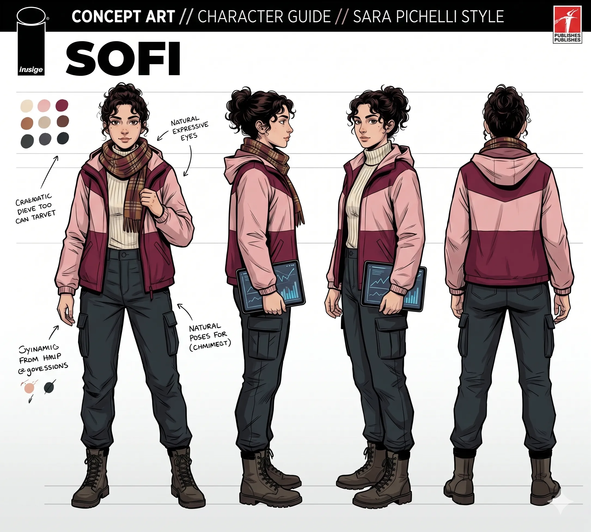
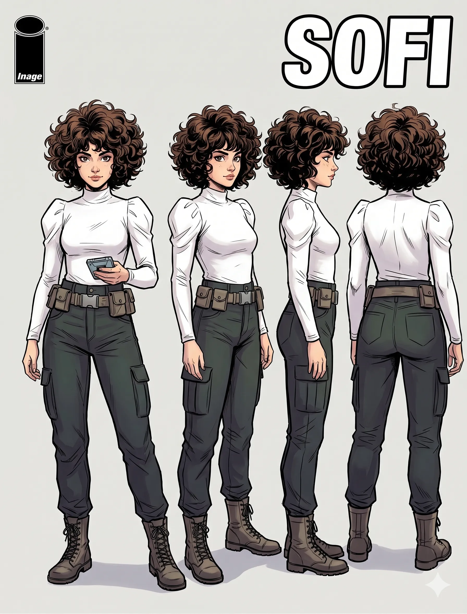
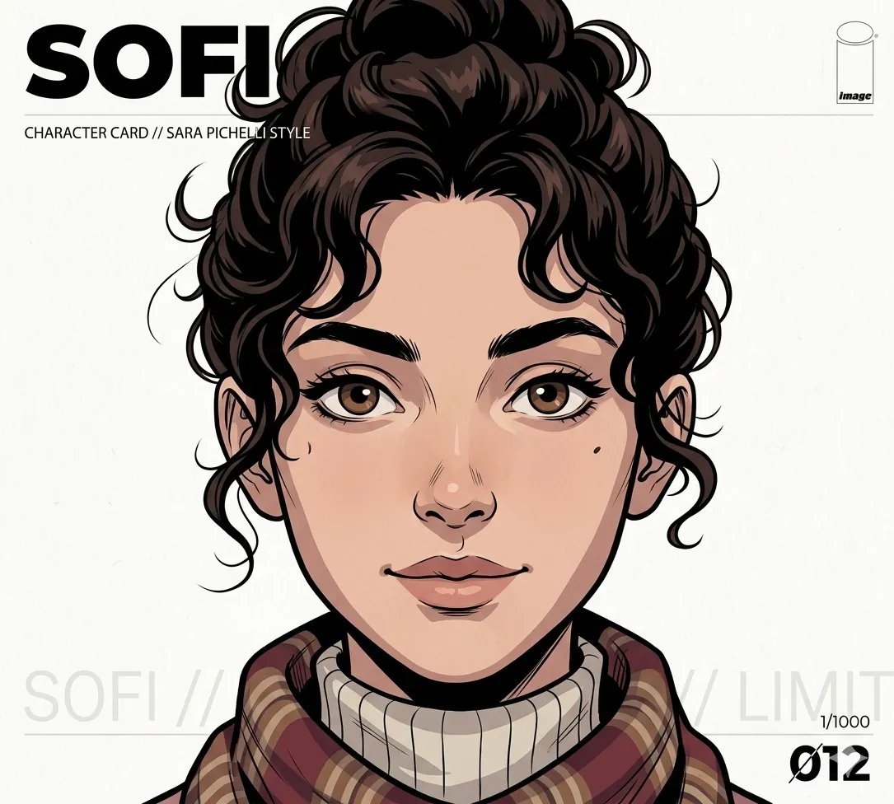

# 🎨 Arte y Prompts Visuales de Sofi (Humana y Variantes con Traje)

Estas descripciones y recursos sirven para generar imágenes de la forma humana de Sofi y sus variantes con traje en herramientas de IA (Midjourney, DALL-E 3) garantizando su consistencia visual.

---

## 👥 1. Aspecto Humano (Diseño Base)

### 🖼️ Recursos Visuales de Humano

#### Cuerpo Completo:

#### Cuerpo Completo (Alternativo):

#### Rostro (Closeup):

### ✍️ Plantilla de Prompt de Apariencia Humana (Inglés)
*   **Cabello:** `dark brown curly hair tied back into a high messy bun with loose wavy curls framing the sides of her face`
*   **Rostro:** `natural expressive dark brown eyes, thick defined dark eyebrows, light skin tone, a small distinct mole on her left cheek below the eye, friendly natural expression, no glasses`
*   **Ropa:** `pink and dark maroon/burgundy color-blocked hooded puffer jacket (pink upper body and sleeves, dark maroon lower body, white accent stripe), cream-colored knit turtleneck sweater underneath, brown and red plaid scarf wrapped around her neck, dark grey cargo pants with side cargo pockets, dark brown leather combat boots`
*   **Accesorios:** `holding a black digital tablet displaying blue graph and data lines in her left hand`

aspecto previo al viaje:
Cabello: thick voluminous curly black hair, tied up high in a messy bun with loose curls framing her face and ears

Rostro: expressive large dark eyes with a shocked and tense gaze, soft light-medium skin tone, natural full lips, defined jawline in a three-quarter view, looking slightly upward in panic

Ropa: cream-white heavy knit turtleneck sweater with detailed vertical ribbed patterns and a thick cozy collar, tucked into high-waisted dark charcoal grey denim pants or cargo pants with visible belt loops
---

## 🦸‍♂️ 2. Aspectos con Traje y Variantes

### 🤫 A. Traje "Hush" (El Eco de las Sombras)
El traje táctico ultraligero que absorbe vibraciones cinéticas y sonido.

#### 🖼️ Recursos Visuales:
*   **Traje Default:** 
*   **Ficha de Personaje:** 

#### ✍️ Plantilla de Prompt de Apariencia de Traje (Inglés):
*   **Prompt Principal:** `A athletic young woman wearing a sleek, form-fitting stealth combat tactical suit in matte black and charcoal colors. The suit has sound-dampening textures and thin grey geometric seams. She is in a low dynamic crouching pose, surrounded by subtle, transparent sound wave ripples bending in the air. High contrast, cinematic lighting, dark background.`

---

### 👑 B. Queen Sofi (Variante de Sofi / Queen Maeve)
Variante de Vought Crossover.

#### ✍️ Plantilla de Prompt de Apariencia (Inglés):
*   **Base:** Rostro y cabello de Sofi (rulos atados en rodete, ojos oscuros, sin lentes).
*   **Traje Prompt:** `wearing heavy steel battle chestplate armor with dark red trim, a matching tiara on her forehead, holding a massive double-edged broadsword over her shoulders, expression of absolute boredom and superiority.`
