# 🦸‍♂️ Guía Unificada de Personajes — Los Pibes

Este documento reúne toda la información técnica, psicológica, narrativa y visual de los siete miembros fundadores de **Los Pibes**. Sirve como guía de referencia centralizada para la creación de las páginas de personajes en la aplicación, garantizando consistencia absoluta en el lore, sus aspectos visuales y sus dinámicas de equipo.

---

## 📌 Índice de Navegación
1. [Ian — Vesperwing (El Nexo Estratégico)](#-ian-vesperwing-el-nexo-estratégico)
2. [Jaz — Oracle (El Ancla Dimensional)](#-jaz-oracle-el-ancla-dimensional)
3. [Julián — Wildcard (El Modificador de Energía Pura)](#-julián-wildcard-el-modificador-de-energía-pura)
4. [Mati — Swapfire (El Reactor Humano)](#-mati-swapfire-el-reactor-humano)
5. [Sofi — Hush (El Eco de las Sombras)](#-sofi-hush-el-eco-de-las-sombras)
6. [Uandi — Aegis (El Escudo Humano)](#-uandi-aegis-el-escudo-humano)
7. [Volvo — Null-Vector (La Velocidad de Escape Dimensional)](#-volvo-null-vector-la-velocidad-de-escape-dimensional)

---

## 🦸‍♂️ Ian — Vesperwing (El Nexo Estratégico)

> "No necesito más poder. Necesito que la gente deje de tomar malas decisiones."

### 👤 Perfil General
*   **Rol en el Roster:** Analista táctico / inventor estratégico / líder de retaguardia.
*   **Origen del Nombre Clave:** Es el único del grupo que diseña e implementa su propia identidad clave de forma intencionada y lógica (tal como diseñaría un traje o un gadget), a diferencia de los otros que los reciben por bromas, rumores o expedientes.

### 👤 Perfil Psicológico y Personalidad
*   **Analista Obsesivo:** Su cerebro funciona como una computadora que calcula variables de forma continua. Vive en constante insomnio, consumiendo café y analizando amenazas potenciales.
*   **Complejo de Salvador:** Siente la responsabilidad absoluta de mantener con vida al grupo. Cree que si un plan falla o alguien sale herido, es culpa directa de su falta de previsión.
*   **Descenso Táctico:** Aunque inicialmente acepta su condición humana como soporte tecnológico, eventualmente se obsesiona con controlar las decisiones emocionales de sus amigos para evitar catástrofes.

### 📊 Estadísticas Básicas
| Atributo | Puntuación |
| :--- | :---: |
| **Fuerza** | 4/10 |
| **Inteligencia** | 6/10 |
| **Carisma** | 6/10 |
| **Suerte** | 5/10 |
| **Combate** | 3/10 |
| **Defensa** | 3/10 |
| **Habilidad Especial (Ingeniería/Tecnología)** | 10/10 |

### ⚡ Poderes y Habilidades
*   **Poder Principal — *Visión de Sistemas*:** Ian percibe patrones, relaciones y puntos críticos con una precisión sobrehumana. Analiza constantemente personas, estructuras y situaciones para visualizar resultados y oportunidades en el campo.
    *   *Capacidades:* Anticipar movimientos, detectar trampas, identificar puntos débiles, analizar sistemas complejos y leer el flujo de una batalla.
    *   *Limitación:* No puede predecir eventos completamente aleatorios ni obtener información que no pueda percibir físicamente.
*   **Habilidad Secundaria — *Ingeniería Adaptativa*:** Desarrolla tecnología para resolver problemas específicos del equipo (herramientas de movilidad, análisis, drones, defensa).
*   **Herramientas y Equipo:**
    *   *Guanteletes Vectoriales:* Dispositivos mecánicos que permiten impulsos de corto alcance, saltos asistidos, amortiguación de impactos y manipulación de objetos mediante pulsos de fuerza.
    *   *GhostLens:* Sistema de análisis táctico integrado en lentes que predice trayectorias en tiempo real y realiza reconocimiento avanzado del terreno.
    *   *Ghostwatch:* Dispositivo de muñeca para comunicaciones seguras, escaneo y gestión de drones aliados.
*   **Movilidad:** Usa una pistola de ganchos (hooks) y planea con su capa ("Velo Táctico"). Con el exotraje completo es capaz de volar.

### 🤝 Relaciones Clave
*   **Uandi (Aegis):** Siente una enorme culpa por el accidente que mutó a Uandi para protegerlo. Agradece su protección, pero teme la impulsividad de su amigo.
*   **Sofi (Hush):** Trabaja estrechamente con ella; diseñó su traje especial Hush que silencia sus movimientos para optimizar sus asaltos sigilosos.
*   **Jaz (Oracle):** Valora su mente analítica y conocimiento arcano. Es la única que comprende las teorías dimensionales abstractas de Ian.

### 📖 Lore e Historia
*   **Lore Actual (El Estratega y la Magia):** Comienza como el cerebro técnico del equipo. Su frustración por ser humano y ver a sus amigos arriesgar la vida lo lleva a tratar la magia y la energía de los Backrooms como ciencias medibles. Integra runas y geometrías en su tecnología, creando armas y trajes a partir de anomalías contenidas.
*   **Lore Proyectado (Emperor Vesper Archor):** Durante el colapso multiversal de las Incursiones provocado por la entidad **Archon**, los héroes fracasan. Ian toma la decisión pragmática de desafiar a Archon, asimilarla en su interior y usar los fragmentos dimensionales para crear un planeta unificado bajo su control absoluto: **Vesperia**. Se corona como su Dios para gobernar las probabilidades y asegurar la supervivencia, erradicando el libre albedrío individual si es necesario (*"There is no God, only Vesper Archor"*).

### 🦾 El Vesper-Hangar (Protocolo Overlord)
Para lidiar con las amenazas de gran escala, Ian cuenta con exotrajes modulares de titanio y fibra de carbono en color gris grafito y negro mate con filamentos en verde oscuro brillante:
*   **Mark III — "The Baseline" (Traje Principal):** El traje que usa en el 90% de los combates en la Tierra. Equilibrado entre placas anatómicas de titanio y movilidad óptima.
*   **Mark LXXXV (85) — "The Cosmic Vesper":** Versión definitiva para misiones en el espacio o multiversales. Presión absoluta para vacío, filtros cuánticos y disipador térmico reforzado para el *Archor Core* (anomalía de los Backrooms contenida en su pecho que le sirve como fuente de energía).
*   **Mark XLIV (44) — "Aegisbuster" (El Rompe-Escudos):** Diseñado en secreto para contener a Uandi si pierde el control por sobrecarga. Usa guanteletes de absorción de impacto, emisores de frecuencias de aturdimiento y sistemas de anclaje hidráulico.
*   **Mark L (50) — "Mecha-Vesper":** Mecha colosal pilotado desde el pecho, usado como artillería pesada móvil contra enemigos de escala Kaiju.

### 🎨 Aspecto Visual y Guía de Generación
*   **Estética:** Interfaces holográficas verde oscuro, wireframes dinámicos, diagramas flotantes, líneas vectoriales verde oscuro proyectadas sobre el entorno.
*   **Aspecto Humano (Diseño Base):**
    *   *Prompt (Inglés):* `neatly styled rich textured dark brown wavy hair, voluminous top with natural flow, clean-cut sides, expressive light brown eyes, light skin tone, no facial hair, strong jawline with three-quarter facial definition, wearing round black-rimmed glasses with a multi-layered frame, dark charcoal grey pullover hoodie showing detailed fabric texture, tailored black slim-fit jeans, brown sneakers with white soles, wearing a sleek modern digital smartwatch on his wrist.`
*   **Aspecto con Traje (Protocolo Overlord):**
    *   *Prompt (Inglés):* `A young man wearing a high-tech modular tactical superhero armor suit made of dark graphite grey and matte black titanium plates. Thin glowing dark green energy filaments pulse along the seams of the chest and joints. He wears a sleek, aerodynamically closed helmet with two thin glowing electric green visor optics. A dark high-tech cape is folded over his shoulders. Wielding mechanical wrist gauntlets with green energy accents. Glowing emerald green energy thrusters ignite from the soles of his combat boots.`
*   **Emperor Vesper Archor (Final Form):**
    *   *Prompt (Inglés):* `A divine cosmic overlord in heavy matte black armor plates. Bright red glowing antimatter runes are etched along the seams and joints of the armor. The helmet is a smooth, featureless dark mask with no visor or optics, showing a deep dark void on the face. A living stellar cape made of pure dark matter and sparkling star dust flows dynamically behind him. Red plasma sparks crackle around his hands.`
*   **Crossover — Ian Boy (Soldier Boy):**
    *   *Prompt (Inglés):* `cynical grumpy expression, wearing dark olive green scale-pattern tactical military armor suit with a heavy leather chest harness, bronze buckles, and reinforced metal pauldrons. Retro World War II steel combat helmet with black-rimmed glasses fitted underneath. Carrying a battle-worn triangular medieval-style kite shield forged from dark matte metal with a stylized bronze eagle embossed in the center. Shield has scratches and battle dents.`

#### 🖼️ Recursos Visuales de Ian
| Humano | Traje Default | Traje Alternativo (Infiltración) |
| :---: | :---: | :---: |
| 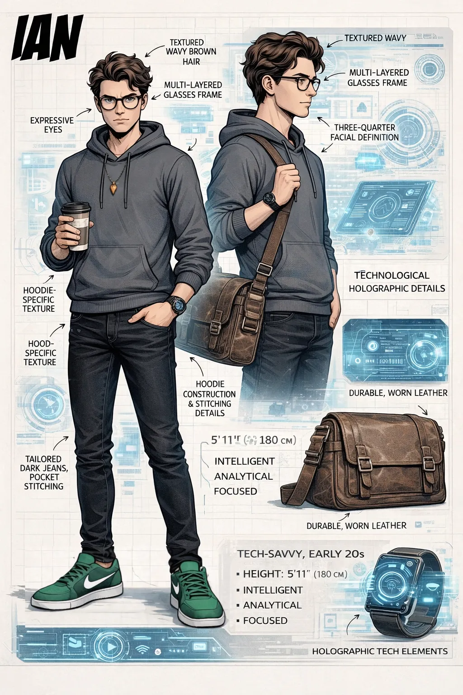 |  |  |

| Mark III — "The Baseline" | Mark L — "Mecha-Vesper" | Emperor Vesper Archor |
| :---: | :---: | :---: |
|  |  |  |

*   **Fichas de Referencia:**
    *   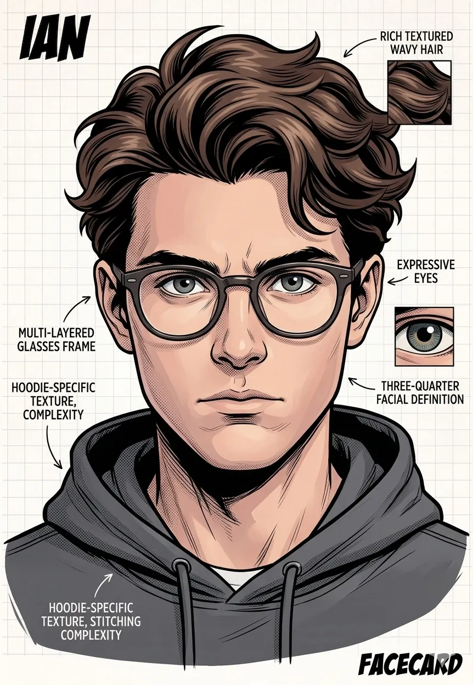
    *   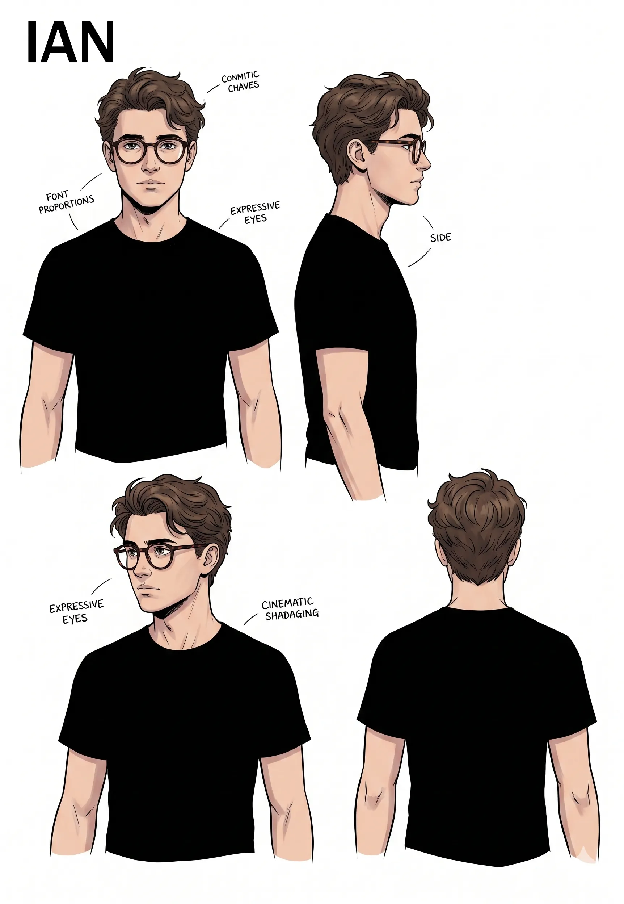
    *   
    *   
    *   
    *   
    *   
    *   

---

## 🔮 Jaz — Oracle (El Ancla Dimensional)

> "La realidad es solo una ecuación geométrica esperando ser reescrita."

### 👤 Perfil General
*   **Rol en el Roster:** Soporte defensivo / control de área / ancla de realidad.
*   **Origen del Nombre Clave:** Nace como una broma de Uandi tras verla pasar horas en la Base de Dumbo rodeada de runas, mapas y anotaciones intentando interpretar las anomalías dimensionales: *"—¿Y qué dicen los espíritus hoy? Preguntale al oráculo..."*

### 👤 Perfil Psicológico y Personalidad
*   **Intelecto y Calma:** Jaz es reflexiva y reservada. Mantiene la compostura incluso cuando la realidad a su alrededor se fractura, actuando como el polo a tierra de Los Pibes.
*   **Curiosidad Insaciable:** Le apasiona el conocimiento fundamental. Su obsesión es comprender el funcionamiento interno de las dimensiones alternativas y los Backrooms.

### 📊 Estadísticas Básicas
| Atributo | Puntuación |
| :--- | :---: |
| **Fuerza** | 3/10 |
| **Inteligencia** | 5/10 |
| **Carisma** | 5/10 |
| **Suerte** | 4/10 |
| **Combate** | 3/10 |
| **Defensa** | 6/10 |
| **Habilidad Especial (Misticismo Astral)** | 9/10 |

### ⚡ Poderes y Habilidades
*   **Poder Principal — *Manipulación de Runas y Energía Astral*:** Utiliza símbolos y geometrías sagradas para canalizar energía astral. Genera escudos de energía infranqueables, trampas rúnicas que inmovilizan enemigos y campos de fuerza defensivos.
    *   *Limitación:* Requiere concentración extrema. La exposición prolongada a la energía astral desgasta gradualmente su conexión con el plano físico.
*   **Habilidad de Combate — *Modo Ruptura*:** Abre pequeñas grietas espaciales para desviar proyectiles enemigos o reposicionar amenazas inmediatas.
*   **Herramientas y Equipo:**
    *   *Catalizador Arcane:* Talismán o colgante con una gema verde que ayuda a canalizar y enfocar la energía de las runas, previniendo la dispersión mágica.
*   **Movilidad:** Teletransportación de corto alcance mediante portales rúnicos y flotación temporal sobre el terreno.

### 🤝 Relaciones Clave
*   **Uandi (Aegis):** Tienen una relación divertida de hermanos. Uandi suele burlarse de su misticismo, pero ella siempre está lista para protegerlo cuando él se lanza impulsivamente al peligro.
*   **Ian (Vesperwing):** Comparte el enfoque analítico. Pasan horas cruzando datos tecnológicos de Ian con teorías rúnicas de Jaz para mejorar los gadgets del grupo.

### 📖 Lore e Historia
*   **Lore Actual (El Ancla del Nexo):** Tras escapar de los Backrooms, Jaz se dedica a mapear las incursiones dimensionales. Usa sus barreras rúnicas para contener parches inestables de realidad y evitar que la Tierra colapse. Es la única del grupo capaz de detectar amenazas interdimensionales de forma temprana (como el Consejo de Matis).
*   **Lore Proyectado (El Límite de la Ruptura):** Enfrentada a amenazas multiversales masivas, Jaz se ve obligada a exceder el uso de energía astral, entrando en **Ruptura Completa**: sus runas doradas cubren su piel, sus ojos se vuelven cuencas de luz y pierde gradualmente sus recuerdos humanos, convirtiéndose en una entidad del Nexo para estabilizar el multiverso a costa de su identidad.

### 🎨 Aspecto Visual y Guía de Generación
*   **Estética:** Runas de luz verde esmeralda y dorada, glifos flotantes, distorsiones espaciales suaves y destellos astrales.
*   **Aspecto Humano (Diseño Base):**
    *   *Prompt (Inglés):* `long straight hair with a sunset-gold ombre gradient (dark brown at the roots, transitioning to warm golden blonde at the tips), flowing naturally, lit by warm sunset lighting, expressive light brown/hazel eyes with detailed eyelashes, light skin tone, wearing clear-rimmed cat-eye glasses with a golden metal bridge, subtle dark lipstick, clean and defined facial structure. She wears a black long-sleeve turtleneck sweater with ribbed collar detail, tight black leggings, black leather military combat boots with detailed laces, and always wearing a delicate necklace with a small green gemstone pendant.`
*   **Aspecto con Traje (Oracle):**
    *   *Prompt (Inglés):* `A female superhero suit, combining sleek dark blue, gold, and white fabric panels. The suit features detailed arcane runic patterns on the surface. She has metallic gold wrist guards. She is wearing a delicate silver necklace with a small glowing emerald-green square gemstone pendant. The scene is illuminated by glowing green and gold cosmic runes and floating glyphs.`
*   **Crossover — Jazlight (Starlight):**
    *   *Prompt (Inglés):* `white and gold corporate superhero spandex suit with star emblems, white boots, gold tiara, hands glowing with bright white plasma energy, eyes glowing solid white.`

#### 🖼️ Recursos Visuales de Jaz
| Humana | Traje Default | Ficha de Personaje |
| :---: | :---: | :---: |
| 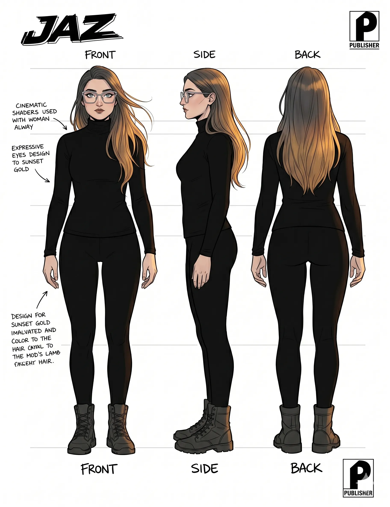 |  |  |

*   **Fichas de Referencia:**
    *   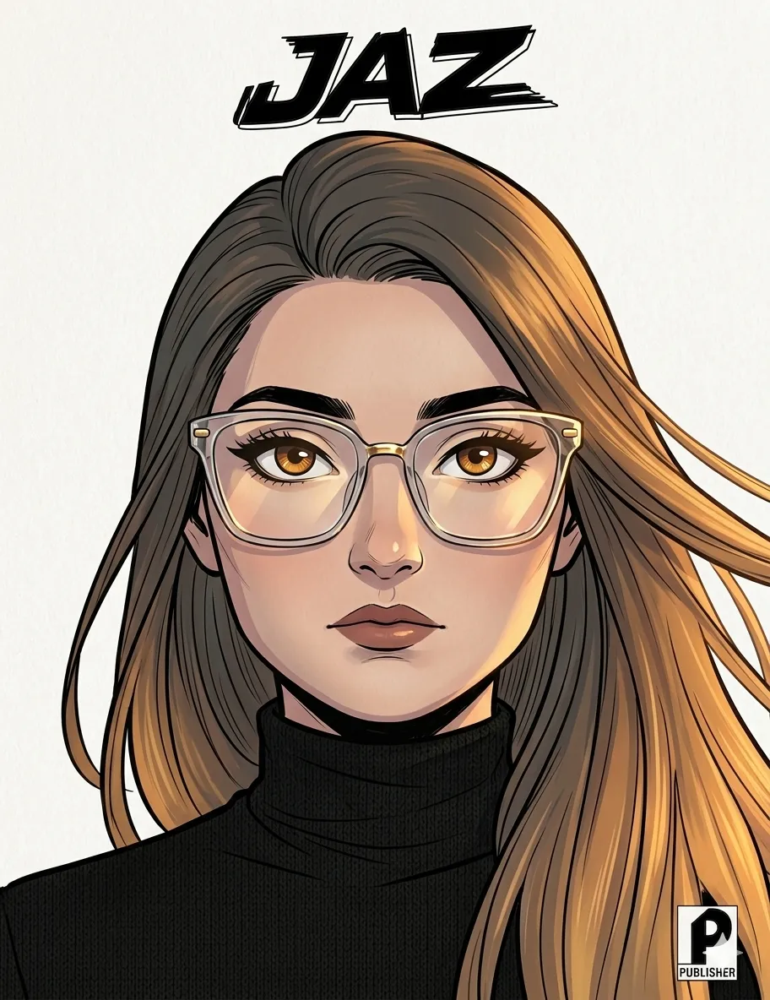
    *   

---

## ⚡ Julián — Wildcard (El Modificador de Energía Pura)

> "Sé que soy un desastre, pero siempre me queda una carta bajo la manga."

### 👤 Perfil General
*   **Rol en el Roster:** Hostigador ágil / distracción táctica / daño por fricción energética.
*   **Origen del Nombre Clave:** Acuñado por Ian durante una misión crítica sin plan claro en la que Julián afirmó que siempre le salía una buena carta. Es un "comodín" impredecible capaz de improvisar herramientas versátiles.

### 👤 Perfil Psicológico y Personalidad
*   **Sarcástico y Ansioso:** Oculta un alto nivel de ansiedad bajo comentarios sarcásticos y chistes inoportunos. Es el alivio cómico del grupo, pero a la vez teme profundamente a las amenazas reales.
*   **Impredecible y Sucio:** Su estilo de combate esquiva la lógica caballeresca. Prefiere engañar, usar señuelos (clones), trampas rápidas y agilidad antes que la confrontación física directa.
*   **El Switch de la Bomber Roja:** Vestirse con su traje cósmico actúa como un interruptor psicológico para él: le recuerda que "la situación se volvió global/multiversal", obligándolo a enfocarse con seriedad.

### 📊 Estadísticas Básicas
| Atributo | Puntuación |
| :--- | :---: |
| **Fuerza** | 3/10 |
| **Inteligencia** | 7/10 |
| **Carisma** | 8/10 |
| **Suerte** | 9/10 |
| **Combate** | 6/10 |
| **Defensa** | 4/10 |
| **Habilidad Especial (Energía Pura)** | 9/10 |

### ⚡ Poderes y Habilidades
*   **Poder Principal — *Modificación de Energía Pura Inestable*:** Genera constructos efímeros de energía glitch (azul y roja). Inyecta estática inestable para cortocircuitar flujos de combate y materia física.
*   **Sistema de Conducción — *Ecos de Presencia (Clones)*:** Construcciones de energía glitch con reglas de batería y degradación:
    *   *Eco de Distracción (Baja Batería):* Dura segundos, parpadea en estática y desvía la atención enemiga. Detona de forma inofensiva al destruirse.
    *   *Eco de Asalto (Alta Batería):* Mantiene cohesión y combate físico, pero su propia actividad consume la energía hasta degradarse en estática cromática.
    *   *Detonación Controlada:* Julián puede detonar un Eco a voluntad; el daño es proporcional a su energía residual.
*   **Kit Táctico (Constructos Efímeros):**
    *   *Naipes de Energía:* Proyectiles afilados que estallan en chispas de fricción al golpear.
    *   *Vara de Truco:* Bastón extensible de energía ligera que puede anclarse y detonar tras 3 segundos.
    *   *Dagas de Proyección:* Hojas de estática en sus nudillos que se quiebran dentro del oponente para detonar de forma retardada.
    *   *Lazo de Tensión:* Cable de estática densa para movilidad o atrapar enemigos. Admite sobrecargas eléctricas.
    *   *Dados y Monedas:* Minas tácticas cargadas de energía cinética que emiten pulsos EMP al paso del enemigo.
*   **Recurso Endgame — *Sobrecarga de Masa*:** Inyecta energía inestable en objetos de gran tamaño (autos, escombros) para crear bombas. Requiere contacto estático continuo (varios segundos inmóvil) y le genera migrañas masivas y sangrado nasal.

### 🤝 Relaciones Clave
*   **Mati (Swapfire):** Se burla constantemente de él y se niega a usar su alias, llamándolo simplemente "el Mati" o "el mati de mierda" en tono cómico y cercano.
*   **Ian (Vesperwing):** Choca de frente con la rigidez y protocolos de Ian. Aunque depende de su tecnología (como su casco), prefiere la improvisación pura.
*   **Uandi (Aegis):** Conexión profunda. Julián actúa como "cable a tierra" y "válvula de escape" disipando el exceso de energía cinética acumulada en Uandi para evitar su sobrecalentamiento.

### 📖 Lore e Historia
*   **Lore Actual (El Impostor de Posibilidades):** Se adapta a su rol de infiltrador. Sufre por la inestabilidad de su poder: cada vez que absorbe los recuerdos de un Eco desintegrado experimenta sobrecarga sináptica, temiendo que su propia mente y cuerpo se disuelvan en estática analógica.
*   **Lore Proyectado (El Guionista de la Realidad):** Descubre que la estática que manipula es la materia prima de las líneas temporales. Aprende a realizar **Edición Narrativa Táctica** para forzar paradojas breves (ej. sostener un puente roto por 3 segundos). Abusar de esto arriesga un derrame cerebral o quedar atrapado en descorrelación cuántica en el vacío interdimensional.

### 🎨 Aspecto Visual y Guía de Generación
*   **Estética:** Estática cromática azul y roja, distorsiones tipo glitch analógico, chispas de fricción de energía inestable.
*   **Aspecto Humano (Diseño Base):**
    *   *Prompt (Inglés):* `short curly black hair with voluminous styled curls on top and a clean skin-fade on the sides and back, alert and focused dark brown eyes, light skin tone, neatly trimmed short black beard and mustache (medium stubble), slender and athletic build, wearing a dark navy blue long-sleeve crewneck sweater showing worn cotton texture and ribbed collar, black slim-fit pants, dark brown leather lace-up combat boots.`
*   **Aspecto con Traje Cósmico (Wildcard):**
    *   *Prompt (Inglés):* `A young man wearing a high-tech Star-Lord inspired cosmic suit. He wears a fitted burgundy leather bomber jacket with off-center zippers and mechanical lapels. A sleek, collapsible metallic helmet covers his face, featuring glowing analog blue optic visor lenses. Red and blue holographic glitch sparks and static lines crackle around him. Highly detailed, cinematic lighting, cyberpunk edge.`
*   **Crossover — Julander (Homelander):**
    *   *Prompt (Inglés):* `arrogant smile, glowing light-blue eyes, wearing a glossy blue and red spandex superhero suit with gold eagle pauldrons on shoulders, a large red flag-like cape, and red leather gloves.`

#### 🖼️ Recursos Visuales de Julián
| Humano | Traje Default | Traje Cósmico (Combat) |
| :---: | :---: | :---: |
| 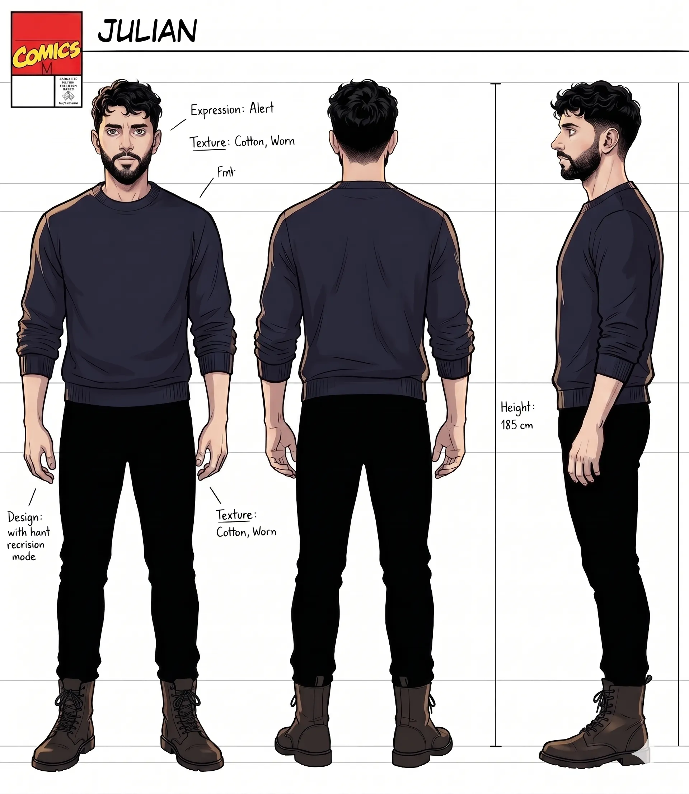 |  |  |

*   **Fichas de Referencia:**
    *   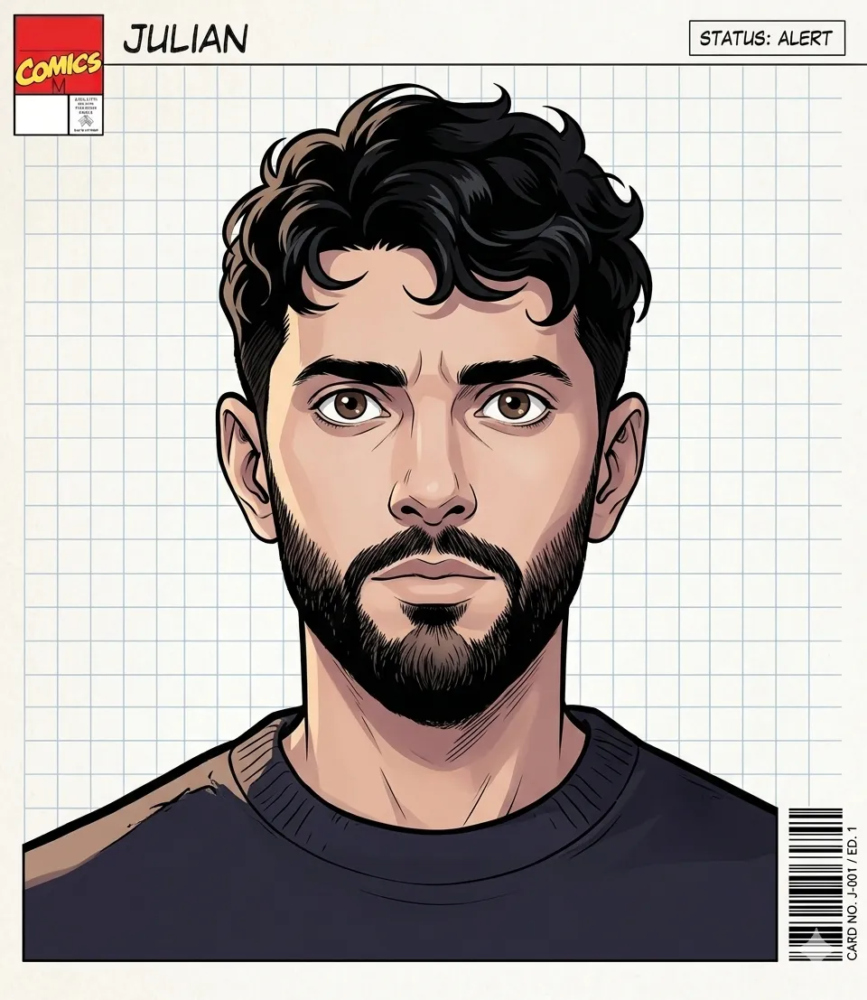
    *   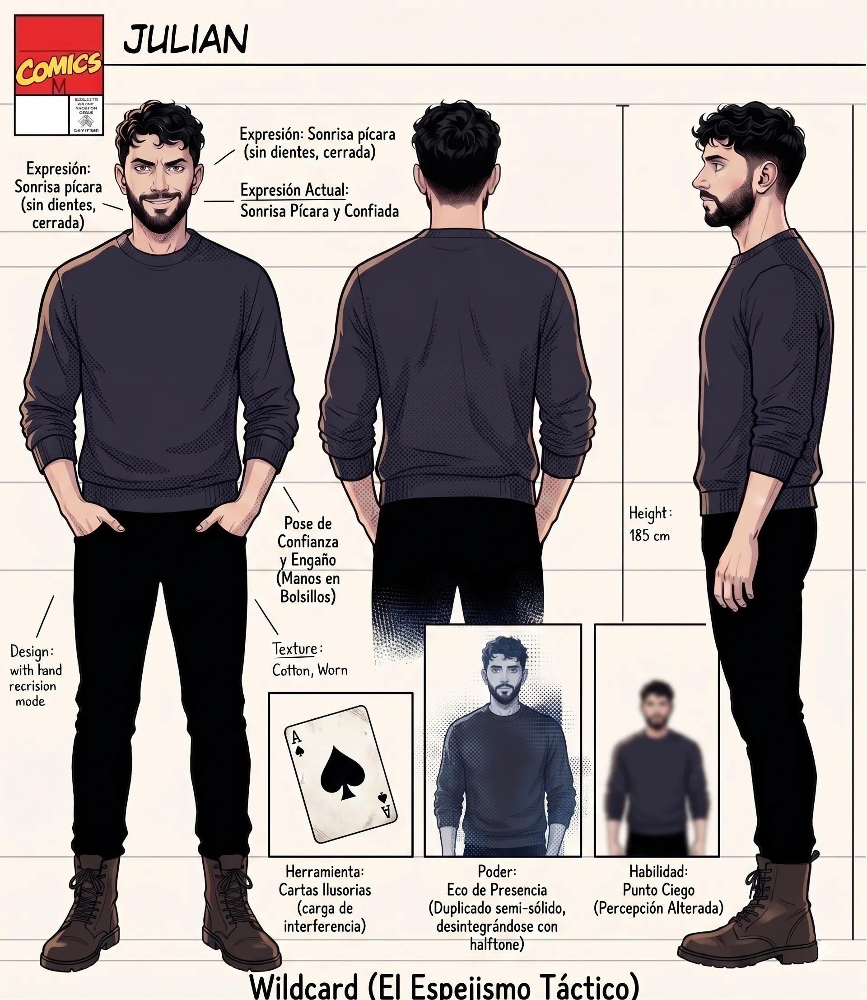
    *   
    *   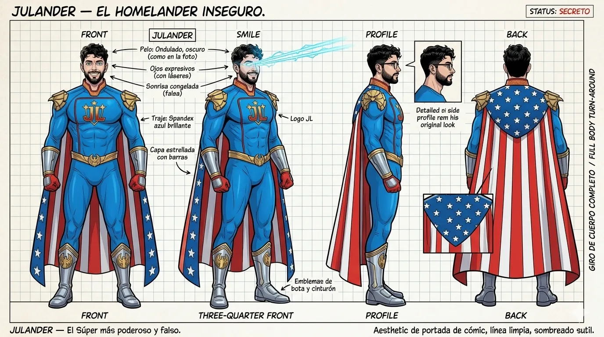

---

## 🔴 Mati — Swapfire (El Reactor Humano)

> "Sabe que sus ojos son una ventana al colapso multiversal, y no se permite parpadear cuando importa."

### 👤 Perfil General
*   **Rol en el Roster:** Controlador táctico / reposicionamiento / artillería de plasma a larga distancia.
*   **Origen del Nombre Clave:** Proviene de su capacidad para combinar ráfagas de plasma concentrado dirigidas por la mirada con habilidades de intercambio y reposicionamiento físico en combate (swap + fire).

### 👤 Perfil Psicológico y Personalidad
*   **El Descontracturador Jovial:** Sumamente carismático, divertido y amante de los memes. Alivia las tensiones del grupo en medio del peligro con chistes e ironía.
*   **El Matiz Polémico:** Dispara teorías de conspiración locas o comentarios conflictivos que descolocan a Los Pibes, siempre de forma noble e inofensiva.
*   **El Switch Táctico (La Frialdad):** Ante una crisis real, desactiva su faceta bromista para asumir el liderazgo del frente, tomando decisiones difíciles con una madurez pragmática.

### 📊 Estadísticas Básicas
| Atributo | Puntuación |
| :--- | :---: |
| **Fuerza** | 6/10 (Fuerza física aumentada) |
| **Inteligencia** | 6/10 |
| **Carisma** | 7/10 |
| **Suerte** | 4/10 |
| **Combate** | 5/10 |
| **Defensa** | 5/10 (Resistencia dérmica reforzada) |
| **Habilidad Especial (Intercambio)** | 10/10 |

### ⚡ Poderes y Habilidades
*   **Poder Principal — *The Aperture (La Apertura)*:** Sus ojos son portales físicos a una dimensión de plasma violeta pura. Su cuerpo actúa como un nexo cuántico que absorbe la energía térmica de sus contrapartes en otras realidades (el "Mativerse").
    *   *Visor de Conducción Táctica:* Creado por Ian, le permite regular el diámetro, intensidad y dirección del haz de plasma.
    *   *Uso sin Visor (Catastrófico):* Si intenta usar sus poderes sin el visor, el rayo de plasma cubre todo su campo visual al instante, desatando una destrucción masiva y fuego aliado.
*   **Modos de Disparo (Guiados por la Mirada):**
    *   *Ráfagas Geométricas:* Rayos finos de plasma violeta calculados para rebotar en superficies densas (suelo, metal) y alcanzar objetivos tras coberturas.
    *   *Overdrive Multiversal:* Apertura máxima del visor para liberar un pilar masivo de plasma. Genera un retroceso inmenso que le exige usar las botas de anclaje de su traje de combate.
*   **Limitaciones y Crisis — *Meltdown (Fusión)*:**
    *   *Saturación Térmica:* Disparar continuamente calienta su cuerpo. El plasma brilla bajo su piel provocándole quemaduras internas. En este estado de crisis, el rayo violeta se tiñe de tonos rojos incandescentes.
    *   *Pérdida del Visor:* Lo obliga a pelear a ciegas para evitar destruir a sus aliados.

### 🦾 Fisiología y Supervivencia
*   **Resistencia Dérmica:** Su piel reforzada por el plasma le permite resistir proyectiles balísticos leves sin sufrir daños en sus órganos internos.
*   **Burbuja Atmosférica:** Proyecta de manera pasiva una burbuja de anclaje que retiene una porción de atmósfera terrestre a su alrededor, permitiéndole sobrevivir en el espacio y vacío absoluto.

### 🤝 Relaciones Clave
*   **Julián:** Intercambio constante de chicanas y bromas. Los insultos divertidos de Julián ("Mati de mierda") se responden siempre con memes e ironías.
*   **Ian (Vesperwing):** Ian diseña su tecnología de retaguardia, pero en la línea de fuego es Mati quien asume la batuta táctica debido a su poder de fuego bruto.

### 📖 Lore e Historia
*   **Lore Actual (La Guerra Mativersal):** Su cuerpo actúa como la batería cuántica del Mativerse. Sus variantes en otras dimensiones funcionan como generadores de su reactor. Si una variante muere, experimenta un subidón térmico doloroso. Actualmente, su variante maligna **Mati Prime** ha desatado una guerra para centralizar la energía multiversal.
*   **Lore Proyectado (El Consejo de Matis):** Mati debe enfrentar a la "Corte de los Matis" (variantes como *Gladiador*, *Astronauta*, *Augusto*, *Pixel*, *Warden* y *Dweller*) y derrotar a *Mati Prime "El Arquitecto"*, quien busca destruir el libre albedrío multiversal por considerarlo una inestabilidad de software.

### 🎨 Aspecto Visual y Guía de Generación
*   **Estética:** Rayos de plasma sólido color violeta base constante, teñido de rojo fuego solo en momentos de sobrecalentamiento (Meltdown).
*   **Aspecto Humano (Diseño Base):**
    *   *Prompt (Inglés):* `short neat black hair combed to the side, cleanly parted and swept to the right, warm friendly smile with expressive dimples on his cheeks, warm tan skin tone, unobstructed brown eyes, no facial hair. He wears a dark grey tactical bomber jacket with a stand-up collar, vertical chest zipper pocket, left sleeve zipper pocket, dark olive green crewneck ribbed sweater underneath, khaki-brown cargo pants with side pockets, grey sneakers with white soles.`
*   **Aspecto con Traje (Swapfire):**
    *   *Prompt (Inglés):* `A young man wearing a high-tech tactical combat superhero suit. The suit is dark grey and black with detailed fabric texture and violet lining. He is wearing a sleek tactical visor over his eyes that emits a glowing violet plasma beam. In dynamic action pose, guiding the beam with his gaze. High contrast, cinematic lighting.`

#### 🖼️ Recursos Visuales de Mati
| Humano | Traje Default | Traje de Combate |
| :---: | :---: | :---: |
| 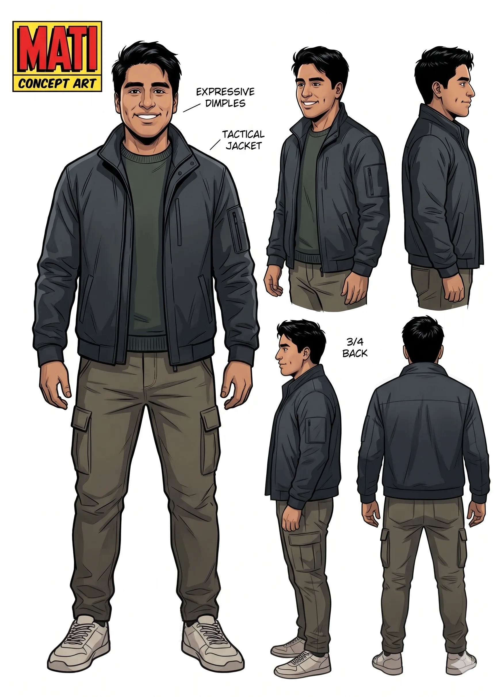 |  |  |

*   **El Consejo de Matis & Variantes:**
    *   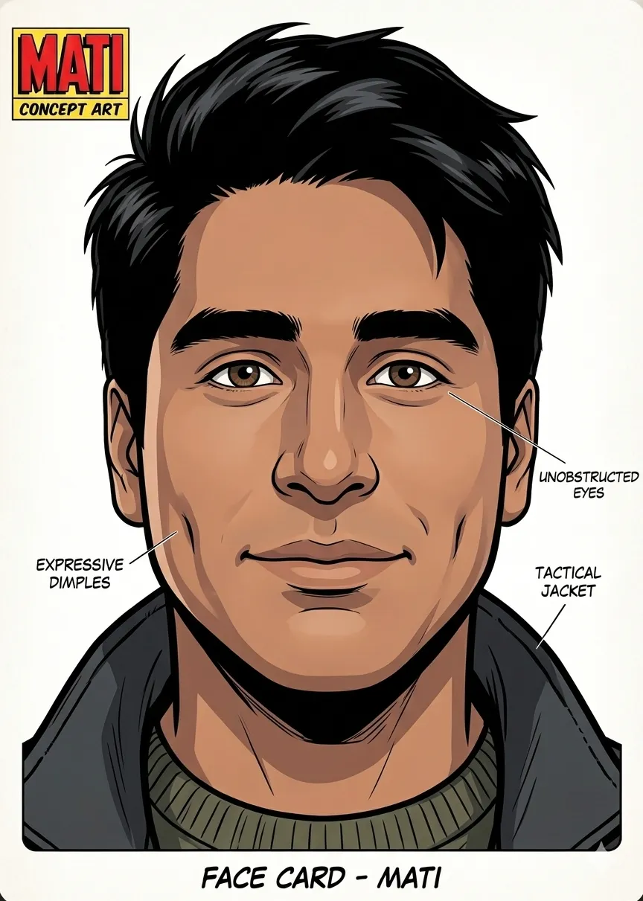
    *   
    *   
    *   
    *   
    *   
    *   

---

## 🤫 Sofi — Hush (El Eco de las Sombras)

> "Si Hush te escucha, estás muerto."

### 👤 Perfil General
*   **Rol en el Roster:** Especialista en infiltración / sigilo / duelista de corto alcance.
*   **Origen del Nombre Clave:** Nace de la leyenda urbana y el terror de las mafias en las calles de Los Ángeles, quienes sabían que si ella los escuchaba planeando un golpe a través de las paredes, su destino estaba sellado.

### 👤 Perfil Psicológico y Personalidad
*   **Vigilante Alerta:** Pragmática, desconfiada y con gran agudeza mental forjada en su supervivencia solitaria. Analiza constantemente los sonidos de su entorno, pareciendo distraída cuando en realidad está hiper-alerta.
*   **Independiente:** Al haber actuado sola, le cuesta adaptarse a dinámicas de grupo estrictas, pero demuestra una lealtad absoluta una vez que confía.

### 📊 Estadísticas Básicas
| Atributo | Puntuación |
| :--- | :---: |
| **Fuerza** | 4/10 |
| **Inteligencia** | 5/10 |
| **Carisma** | 4/10 |
| **Suerte** | 5/10 |
| **Combate** | 5/10 |
| **Defensa** | 4/10 |
| **Habilidad Especial (Radar/Sigilo)** | 9/10 |

### ⚡ Poderes y Habilidades
*   **Poder Principal — *Ecólisis y Radar Acústico*:** Posee un oído absoluto entrenado al extremo. Mapea entornos cerrados detectando latidos o respiraciones tras muros de concreto. Puede anular por completo la propagación del sonido en su entorno inmediato para moverse sin dejar rastro auditivo.
    *   *Limitación:* Zonas con ruido blanco masivo o distorsiones extremas de frecuencia saturan su percepción sensorial, confundiéndola temporalmente.
*   **Habilidad de Combate — *Precisión Acústica*:** Utiliza su conocimiento de vibraciones para golpear puntos estructurales débiles en enemigos u objetos, amplificando el impacto físico con ondas sonoras concentradas.
*   **Herramientas y Equipo:**
    *   *Traje Hush:* Traje táctico ultraligero diseñado por Ian que absorbe de forma pasiva vibraciones cinéticas y ruidos.
*   **Movilidad:** Extremadamente ágil y acrobática. Mapea el terreno con micro-vibraciones para avanzar rápido y con sigilo absoluto.

### 🤝 Relaciones Clave
*   **Ian (Vesperwing):** Mantiene una colaboración estrecha. Ian confía plenamente en ella como sus "ojos y oídos" en el terreno y desarrolló su traje Hush.
*   **El Equipo:** Su sigilo cubre perfectamente las ruidosas debilidades de compañeros destructivos como Uandi.

### 📖 Lore e Historia
*   **Lore Actual (La Vigilante de Los Ángeles):** A diferencia del resto de Los Pibes, no proviene del incidente de los Backrooms; es nativa del universo alternativo de Los Ángeles. Se cruzó con Los Pibes cuando estos escapaban de anomalías interdimensionales en su realidad. Tras ayudarlos a evadir a la fuerza corporativa de Vought, se unió al equipo como su especialista infiltradora.
*   **Lore Proyectado (El Silencio Absoluto):** Lidera misiones de alto riesgo contra la red de espionaje del Consejo de Matis. Desarrolla la capacidad de anular el sonido en áreas completas ("zonas muertas" de comunicación). Enfrenta el riesgo latente de perder su propio oído por la fatiga y tensión acústica acumulada.

### 🎨 Aspecto Visual y Guía de Generación
*   **Estética:** Ondas sonoras tenues curvándose en el aire, distorsiones de vibración transparentes alrededor de sus puños, sombras que parecen "tragar" el ruido.
*   **Aspecto Humano (Diseño Base):**
    *   *Prompt (Inglés):* `dark brown curly hair tied back into a high messy bun with loose wavy curls framing the sides of her face, natural expressive dark brown eyes, thick defined dark eyebrows, light skin tone, a small distinct mole on her left cheek below the eye, friendly natural expression. She wears a pink and dark maroon color-blocked hooded puffer jacket (pink upper body and sleeves, dark maroon lower body, white accent stripe), cream-colored knit turtleneck sweater underneath, brown and red plaid scarf wrapped around her neck, dark grey cargo pants with side cargo pockets, and dark brown leather combat boots. She is holding a black digital tablet displaying blue data lines.`
*   **Aspecto con Traje (Hush):**
    *   *Prompt (Inglés):* `A athletic young woman wearing a sleek, form-fitting stealth combat tactical suit in matte black and charcoal colors. The suit has sound-dampening textures and thin grey geometric seams. She is in a low dynamic crouching pose, surrounded by subtle, transparent sound wave ripples bending in the air. High contrast, cinematic lighting, dark background.`
*   **Crossover — Queen Sofi (Queen Maeve):**
    *   *Prompt (Inglés):* `wearing heavy steel battle chestplate armor with dark red trim, a matching tiara on her forehead, holding a massive double-edged broadsword over her shoulders, expression of absolute boredom and superiority.`

#### 🖼️ Recursos Visuales de Sofi
| Humana | Traje Default | Traje de Combate |
| :---: | :---: | :---: |
|  |  |  |

*   **Fichas de Referencia:**
    *   
    *   
    *   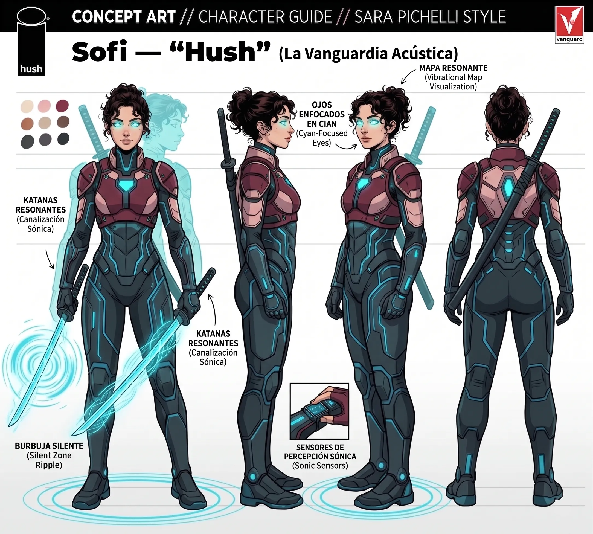
    *   

---

## 🛡️ Uandi — Aegis (El Escudo Humano)

> "No se preocupen, yo los cubro. Move out of the way, Bub."

### 👤 Perfil General
*   **Rol en el Roster:** Tanque principal / protector de primera línea / fuerza bruta.
*   **Origen del Nombre Clave:** Nace del respeto de sus amigos al verlo absorber daños letales para protegerlos: *"—Ese tipo es un escudo. —No es un escudo. Es una maldita Aegis."*
*   **Muletilla:** Llama toscamente a todos (amigos o enemigos) **"Bub"**.

### 👤 Perfil Psicológico y Personalidad
*   **El Escudo Humilde:** Honesto, directo, ingenuo y sumamente noble. Desprecia la complejidad estratégica; su único motor es mantener a salvo a sus amigos a cualquier costo.
*   **Fuerza Bruta Emocional:** Su poder está ligado a su estado emocional; se vuelve más fuerte y resistente a medida que la situación se torna desesperada.
*   **Diseño:** Físico robusto y macizo, anteojos redondos de marco metálico fino y un tatuaje de manga completa en tinta negra en su brazo izquierdo.

### 📊 Estadísticas Básicas
| Atributo | Puntuación |
| :--- | :---: |
| **Fuerza** | 6/10 (Base) / 10/10 (Sobrecargado) |
| **Inteligencia** | 3/10 |
| **Carisma** | 5/10 |
| **Suerte** | 4/10 |
| **Combate** | 5/10 |
| **Defensa** | 6/10 |
| **Habilidad Especial (Reactor Cinético)** | 9/10 |

### ⚡ Poderes y Habilidades
*   **Poder Principal — *Acumulación y Disipación Cinética*:** Su cuerpo actúa como un reactor biológico que absorbe la fuerza de los impactos físicos, caídas o explosiones. Almacena esta energía en runas en su piel, traduciéndola en fuerza física devastadora, velocidad aumentada y regeneración dérmica.
    *   *Limitación:* Debe disipar constantemente la energía almacenada para evitar el sobrecalentamiento térmico del cuerpo.
*   **Habilidad de Combate — *Descarga Cinética (Blast)*:** Expulsa ráfagas de ondas de choque de alta densidad desde su pecho para barrer obstáculos y enemigos.
*   **Movilidad:** Súper saltos impulsados por la liberación de la energía cinética acumulada en sus piernas.

### 🤝 Relaciones Clave
*   **Ian (Vesperwing):** Profundo respeto mutuo. Mientras Ian carga con la culpa del accidente, Uandi lo acepta con naturalidad: Ian es la mente y él es el escudo.
*   **Jaz (Oracle):** Le hace bromas constantes sobre su rol místico, pero es el primero en colocarse delante si ella es atacada.
*   **Julián (Wildcard):** Sinergia táctica alta en el campo. Julián disipa el exceso de calor e inestabilidad de Uandi absorbiéndolo con su estática y puede inyectarle energía de clones destruidos para recargar su batería cinética al instante.

### 📖 Lore e Historia
*   **Lore Actual (El Reactor del Equipo):** Durante la huida de los Backrooms, Uandi se interpuso para proteger a Ian de una descarga inestable de energía cuántica. Su estructura celular absorbió el impacto, adaptándose para acumular y canalizar energía cinética. Con el tiempo, el exceso de energía absorbida genera calor extremo a su alrededor, evaporando agua y resquebrajando la tierra.
*   **Lore Proyectado — *Modo Sobrecarga Cinética*:** Cuando la vida de sus amigos corre peligro extremo, entra en **Sobrecarga Cinética (Crisis)**:
    *   *Aspecto Estandarizado:* Experimenta una **hipertrofia muscular masiva** y su **piel se vuelve incandescente**, mientras las runas rojas brillan con furia en su cuerpo y distorsionan térmicamente el aire (reemplazando ideas de solidificación o texturas rocosas).
    *   *El Costo:* La Sobrecarga anula su juicio racional, dominándolo un impulso obsesivo e incontrolable de proteger que le impide distinguir aliados de enemigos.

### 🎨 Aspecto Visual y Guía de Generación
*   **Estética:** Marcas rúnicas rojas que brillan intensamente por todo su cuerpo, distorsión térmica del aire a su alrededor debido al calor corporal.
*   **Aspecto Humano (Diseño Base):**
    *   *Prompt (Inglés):* `thick textured curly dark brown hair with high volume on top and a clean skin-fade on the sides and back, intense dark eyes with focused gaze, light skin tone, round black wire-framed glasses, short neat beard and mustache. Highly muscular and athletic build, left arm fully covered in a detailed black ink sleeve tattoo (featuring swords, mandalas, leaves, and geometric patterns), right arm is completely clean. He wears a tight-fitting dark grey/navy blue compression short-sleeve t-shirt with a small white Kappa logo on the center of the chest, matching dark grey cargo pants, black tactical belt with buckle, and black lace-up combat boots.`
*   **Aspecto con Traje (Aegis):**
    *   *Prompt (Inglés):* `A highly muscular male superhero suit, form-fitting tactical combat design. Sleek dark metallic and crimson materials. Glowing red runic marks pulse across the body, shoulders, and chest. Heat distortion and warm red glowing lines around his arms and chest. Determined expression, round wire-rimmed glasses showing under a sleek open tactical helmet. High contrast, action pose.`
*   **Crossover — A-Uandi (A-Train):**
    *   *Prompt (Inglés):* `blue and white aerodynamic athletic superhero runner suit, wearing blue-tinted speed goggles, running at supersonic speed leaving a trail of blue motion lines.`

#### 🖼️ Recursos Visuales de Uandi
| Humano | Traje Default | Ficha de Personaje |
| :---: | :---: | :---: |
| 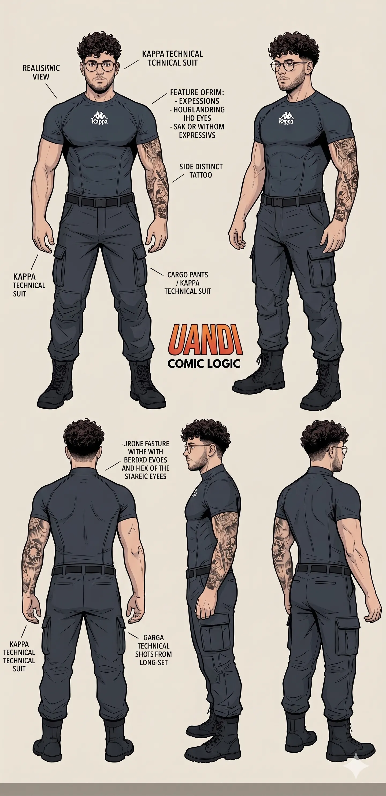 |  |  |

*   **Fichas de Referencia:**
    *   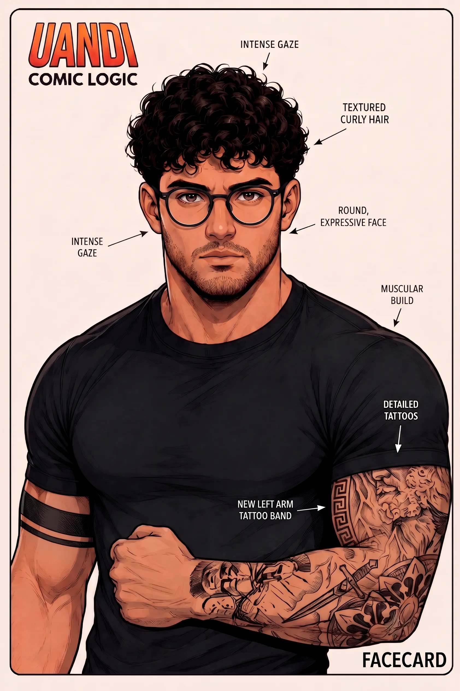
    *   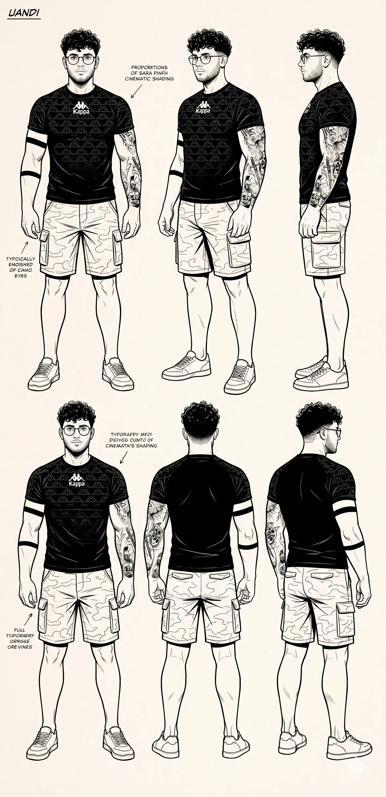
    *   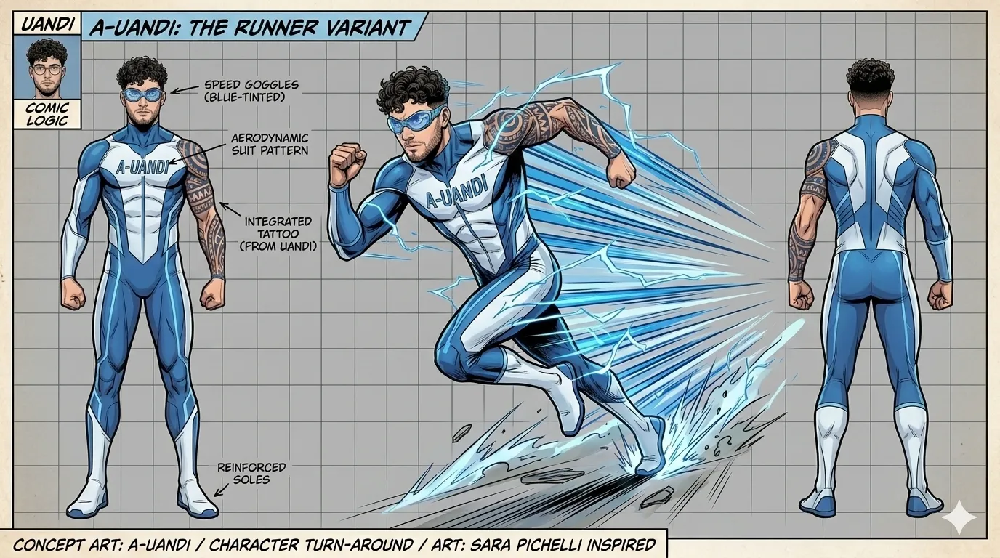

---

## 🧡 Volvo — Null-Vector (La Velocidad de Escape Dimensional)

> "Para cuando te des cuenta de que estuve ahí, ya voy a estar cruzando otro universo."

### 👤 Perfil General
*   **Rol en el Roster:** Vanguardia / movilidad absoluta / infiltración rápida y desborde.
*   **Origen del Nombre Clave:** Proviene de expedientes gubernamentales que registraban fallas de sistemas, caídas de energía y datos corruptos (Null Vector) cada vez que él ingresaba a una instalación.

### 👤 Perfil Psicológico y Personalidad
*   **Impulsivo e Inteligente:** Un hacker brillante pero impaciente. Su carácter impulsivo lo mete en problemas de forma constante, pero su capacidad para improvisar sobre la marcha y hackear sistemas a gran velocidad lo salva en el último segundo.
*   **Traumatizado por el Tiempo:** Pasó años reales sobreviviendo solo en el multiverso de la Corriente, mientras en la Tierra transcurrieron apenas días. Posee la mentalidad pragmática de un veterano de guerra combinada con un miedo profundo a quedarse varado de nuevo.

### 📊 Estadísticas Básicas
| Atributo | Puntuación |
| :--- | :---: |
| **Fuerza** | 4/10 |
| **Inteligencia** | 5/10 |
| **Carisma** | 4/10 |
| **Suerte** | 4/10 |
| **Combate** | 4/10 |
| **Defensa** | 3/10 |
| **Habilidad Especial (Hackeo/Corriente)** | 9/10 |

### ⚡ Poderes y Habilidades
*   **Poder Principal — *Velocidad de Escape Dimensional*:** Se desplaza a velocidades supersónicas que desafían la física, abriendo portales naranjas brillantes en el aire por pura fricción con el espacio-tiempo. Puede cruzar estructuras sólidas abriendo un portal en ellas sobre la marcha.
*   **Biología de la Corriente:**
    *   *Inmunidad de Entorno Natural:* Su cuerpo se adaptó a las leyes físicas del vacío entre realidades, lo que le permite sobrevivir sin cascos, máscaras ni trajes espaciales en el espacio exterior, resistir radiaciones y atmósferas hostiles de forma natural.
    *   *Vibración Atómica (Intangibilidad):* En situaciones críticas, hace vibrar sus átomos a frecuencias cuánticas para volverse intangible por unos breves segundos, permitiendo que amenazas físicas o de energía lo atraviesen sin causarle daño.
*   **Herramientas y Equipo — *Vector Suit (Diseño de Ian)*:**
    *   Traje ultraligero y elástico diseñado con fibras moleculares anti-desgarro para interactuar con la fricción de su velocidad y portales, impidiendo que el traje se queme o rompa al vibrar atómicamente.

### 🤝 Relaciones Clave
*   **Mati (Swapfire):** Inicialmente desconfió de él tras presenciar en secreto al Consejo de Matis, lo que provocó su escape inicial con la pistola de portales. Aunque combaten del mismo lado para proteger su Tierra, mantiene cierta cautela y reserva hacia Mati y sus variantes.
*   **Ian (Vesperwing):** Hackea los sistemas de Ian y sortea sus protocolos de seguridad por diversión, pero respeta profundamente su ingenio técnico.

### 📖 Lore e Historia
*   **Lore Actual (La Amenaza de Reverse Volvo):** Durante los años que pasó varado en la Corriente, cada vez que abría portales dejaba un eco cinético en el vacío. Este exceso de estática oscura y distorsión molecular se amalgamó en **Reverse Volvo** (Reverse Vector), una entidad de estática y energía naranja corrupta que habita en la dimensión del movimiento. Cada vez que Volvo corre al límite debilita la barrera, y Reverse Volvo aparece en las viñetas corriendo justo detrás de él en el fondo del portal, esperando que sufra fatiga muscular para cruzar y usurpar su lugar.

### 🎨 Aspecto Visual y Guía de Generación
*   **Estética:** Portales naranjas brillantes, grietas espaciales en el aire, líneas naranja brillante en su ropa táctica que canalizan la energía residual de las estelas.
*   **Aspecto Humano (Diseño Base):**
    *   *Prompt (Inglés):* `short spiky dark brown hair styled dynamically upwards and forward, piercing light blue-green eyes, thick expressive dark eyebrows, light skin tone, strong jawline with a full short beard and mustache. He wears a plain orange crewneck short-sleeve t-shirt, dark green cargo pants with side pockets and knee panels, brown canvas tactical belt with multiple leather gear pouches on the sides, and brown leather combat boots.`
*   **Aspecto con Traje (Vector Suit):**
    *   *Prompt (Inglés):* `A young athletic man running at super speed, wearing a sleek skin-tight aerodynamic suit in matte black and graphite colors. The suit has glowing bright orange lines and stripes wrapping around his legs, chest, and arms. No helmet or mask, showing his face clearly. He leaves trailing bright orange portal tears and energy rifts in the air behind him. Cyberpunk aesthetic, dynamic action pose, cinematic lighting.`
*   **Crossover — Volvo Butcher (Billy Butcher):**
    *   *Prompt (Inglés):* `rugged look, short messy beard, wearing a long dark brown/black leather trenchcoat over a dark grey plaid button-up shirt, cynical psychopathic smirk, holding a heavy bronze three-barrel energy blaster.`

#### 🖼️ Recursos Visuales de Volvo
| Humano | Traje Default | Traje de Combate |
| :---: | :---: | :---: |
| 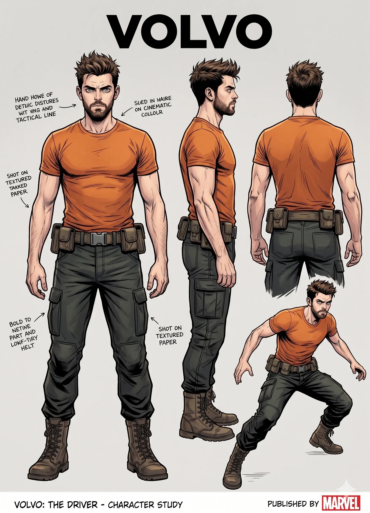 |  |  |

*   **Fichas de Referencia:**
    *   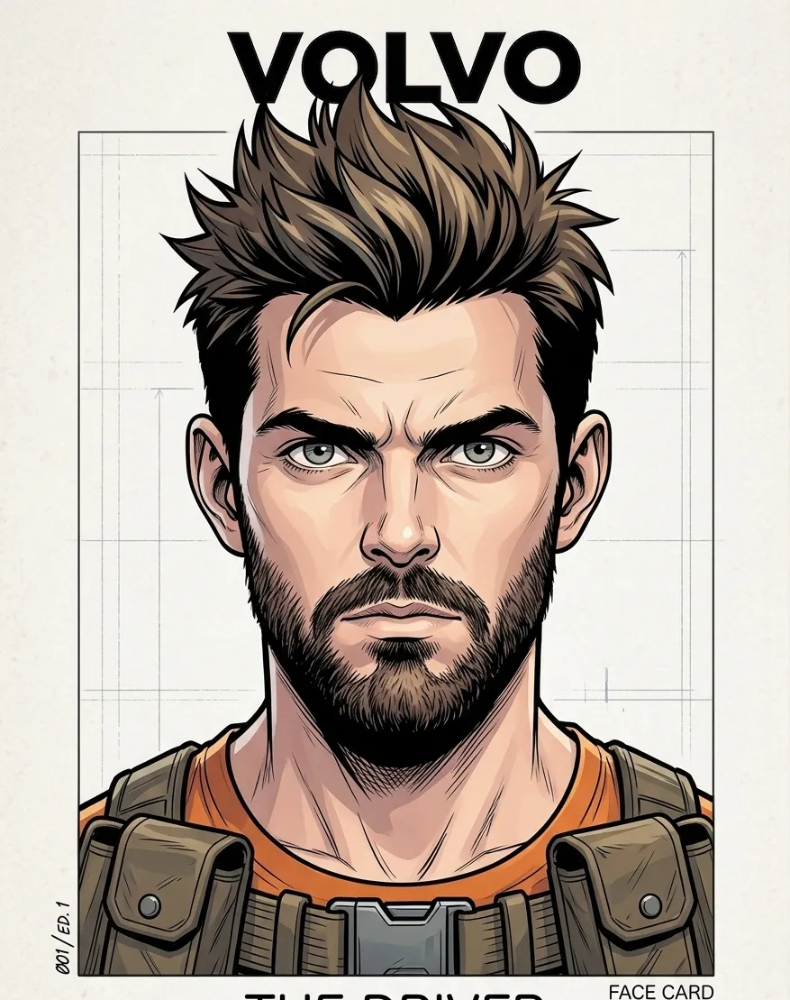
    *   
    *   
