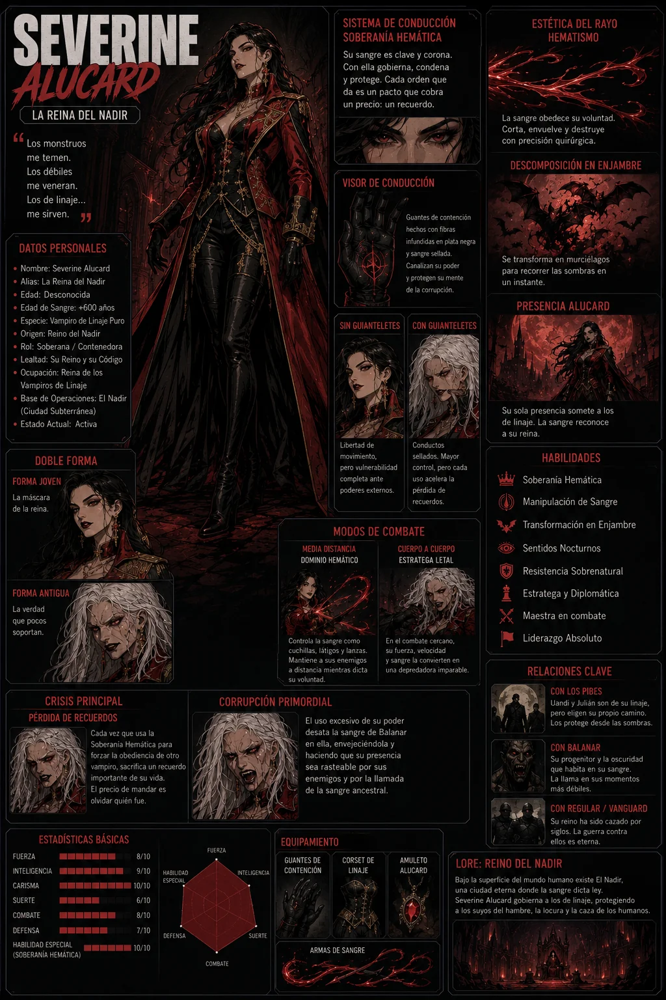
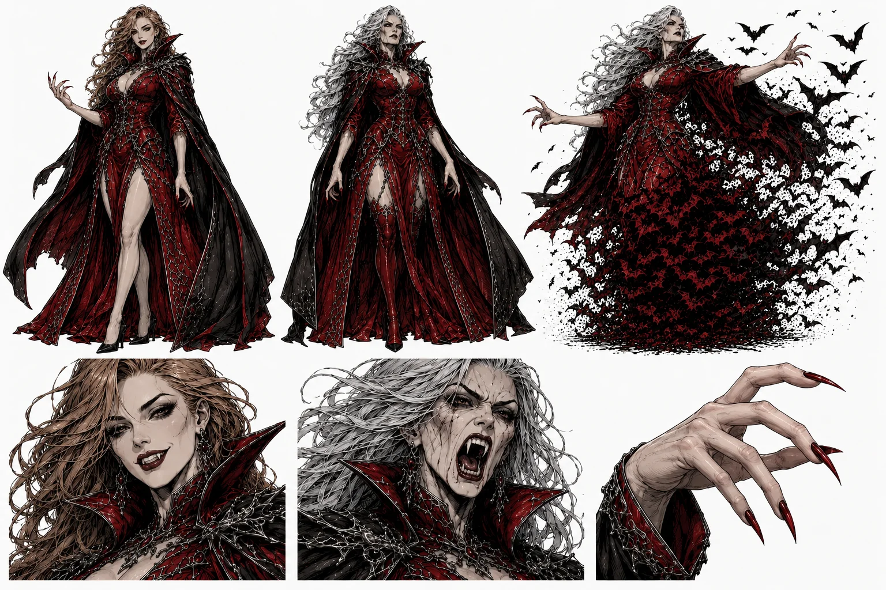
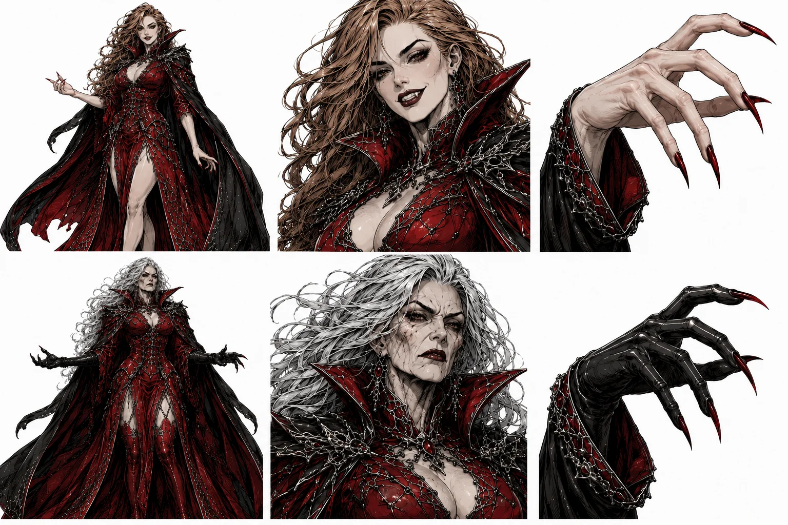

# 🤝 Severine Alucard (La Reina del Nadir)

*   **Categoría:** Personaje Secundario / Reina Vampiro / Aliada Ocasional.
*   **Origen:** Severine Alucard es la última heredera legítima del linaje de Drácula y la soberana del Nadir, una nación vampírica oculta bajo las grandes ciudades del mundo.
*   **El Nadir:** Una civilización subterránea construida sobre antiguas criptas, estaciones abandonadas, catedrales sepultadas y túneles. Allí viven miles de vampiros organizados en casas, clanes, mercados y territorios, gobernados bajo el **Pacto de las Venas**.
*   **Edad de Sangre:** Su cuerpo no envejece de forma normal. Alterna entre dos estados:
    *   **Forma Joven:** Cuando se encuentra alimentada y estable, tiene la apariencia de una mujer joven, de piel intacta y manos descubiertas con las que puede tocar a otros sin dañarlos.
    *   **Forma Antigua:** Al usar todo su poder o estar hambrienta, revela sus siglos reales. Su cabello se vuelve blanco, su rostro envejece y sus manos absorben años de vida al contacto. Por ello usa guantes negros como dispositivos de contención.
*   **Poderes Principales:**
    *   **Soberanía Hemática:** Puede imponer órdenes sobre cualquier vampiro descendiente de Drácula, pero a cambio pierde un recuerdo personal por cada orden.
    *   **Manipulación de Sangre:** Modela su propia sangre en cuchillas, filamentos y sellos tácticos.
    *   **Descomposición:** Se desplaza disolviéndose en murciélagos y bruma a través de las sombras.

---

## 🖼️ Recursos Visuales

### Ficha de Personaje Principal (Forma Joven / Saciada):

### Forma Antigua / Alternativa:

### Model Sheet Adicional:

