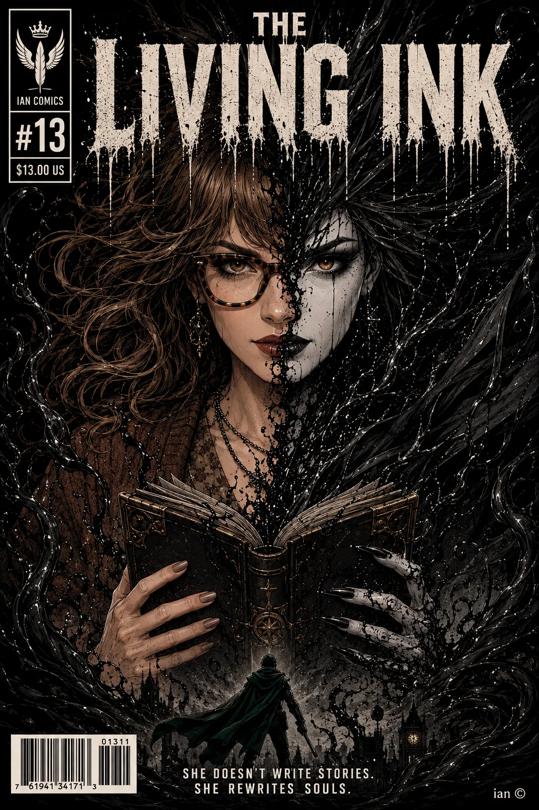
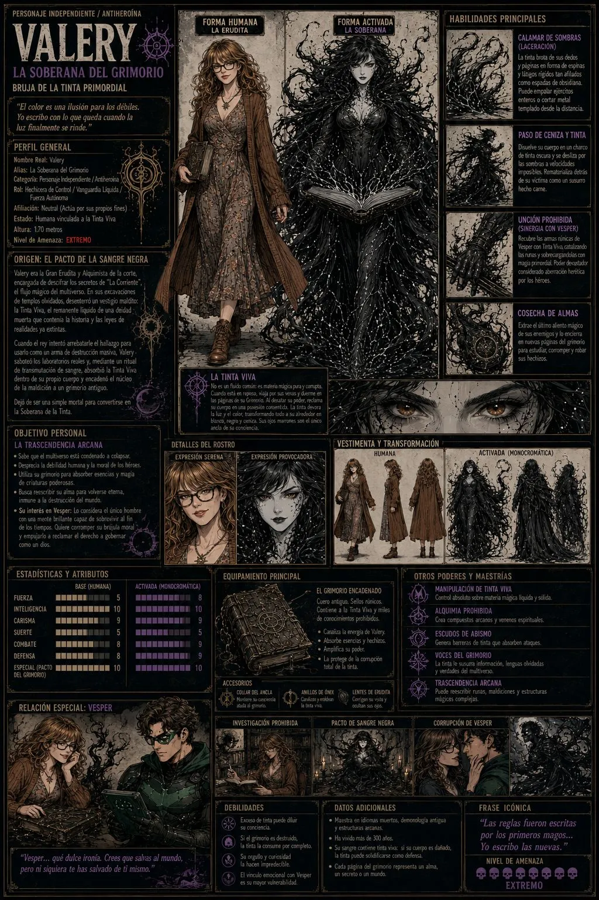

# 🤝 Ficha de Diseño de Personaje: Valery (La Soberana del Grimorio)

* **Categoría:** Personaje Independiente / Antiheroína / Bruja de la Tinta Primordial.
* **Conexión Especial con Vesper (Atracción en la Sombra):** Se cruzan en secreto en los rincones más oscuros del reino. Valery conoce su identidad, pero lo llama despectivamente Vesper, mofándose de su empeño por jugar a ser el salvador. Entre ellos hay una tensión magnética, un deseo intelectual y físico que nunca se concreta porque sus almas operan bajo leyes distintas: él usa la magia de forma ordenada (runas y ecuaciones); ella abraza el caos de las fuerzas prohibidas.

***

## ⏳ Trasfondo: El Pacto de la Sangre Negra
Valery era la Gran Erudita y Alquimista de la corte, encargada de descifrar los secretos de "La Corriente" (el flujo mágico del multiverso). En sus excavaciones de templos olvidados, desenterró un vestigio maldito: la Tinta Viva, el remanente líquido de una deidad muerta que contenía la historia y las leyes de realidades ya extintas.

Cuando el rey intentó arrebatarle el hallazgo para usarlo como un arma de destrucción masiva, Valery demostró su verdadera naturaleza despiadada: saboteó los laboratorios reales y, mediante un ritual de transmutación de sangre, absorbió la Tinta Viva dentro de su propio cuerpo. Para evitar que la sustancia borrara su mente, encadenó el núcleo de la maldición a un grimorio antiguo de cuero oscuro. Dejó de ser una simple mortal para convertirse en la Soberana de la Tinta.

***

## 🎯 Objetivo Personal: La Trascendencia Arcana
Valery desprecia la debilidad humana y la moral de los héroes. Su meta es **La Autonomía Absoluta frente al Destino**:
* Sabe que el multiverso está condenado a colapsar y considera que los humanos comunes son solo ceniza en potencia.
* Utiliza su grimorio para absorber la esencia y la magia de criaturas místicas poderosas, buscando reescribir su propia alma para volverse una entidad eterna, inmune a la destrucción del mundo.
* **Su interés en Vesper:** Lo ve como el único hombre con una mente lo suficientemente brillante como para sobrevivir al fin de los tiempos. Quiere corromper su brújula moral, empujándolo a aceptar que para salvar el mundo primero debe reclamar el derecho a gobernarlo como un dios.

***

## ⚡ El Poder de la Tinta: La Forma Monocromática
* **¿Qué es la Tinta Viva?** No es un fluido común, es materia mágica pura y corrupta. Es un oleaje negro que se alimenta de la fuerza vital de Valery. Cuando está en reposo, viaja por sus venas y duerme en las páginas de su Grimorio.
* **¿Por qué se vuelve Monocromática?** Cuando Valery desata el poder del libro, la Tinta Viva reclama su cuerpo en una posesión consentida. El efecto monocromático es una maldición visual: la tinta es un abismo que devora toda la luz y el color a su alrededor. Su silueta pierde cualquier rastro de calidez humana, transformándose en una ilustración de alto contraste, como si hubiera sido dibujada a mano alzada con pinceladas de tinta negra mate sobre un lienzo blanco ceniza:
  * Su piel se vuelve de un blanco tísico y fantasmal, surcada por ramificaciones negras.
  * Su ropa se transmuta en una armadura líquida y densa con hombreras góticas y filamentos flotantes.
  * Sus ojos marrones son lo único que ella protege con su propia voluntad. Son el ancla de su conciencia, brillando con una calidez intensa y viva en medio del frío absoluto del blanco y negro.

***

## 📊 Estadísticas y Atributos (Ficha Técnica)
* **Rol:** Hechicera de Control / Vanguardia Líquida / Fuerza Autónoma.
* **Stats:**
  * **Fuerza:** 5 (Mortal) | 8 (En Forma Monocromática)
  * **Inteligencia:** 10 (Maestría absoluta en alquimia y artes prohibidas)
  * **Carisma:** 9 (Aura magnética, aristocrática y peligrosa)
  * **Suerte:** 5
  * **Combate:** 8 (Estilo fluido, punzante y ritualista)
  * **Defensa:** 8 (Escudos de sombras y esquiva líquida)
  * **Especial (Pacto del Grimorio):** 10

***

## 🛠️ Habilidades Especiales
* **Calamar de Sombras (Laceración):** Al abrir el Grimorio, la tinta brota de sus dedos y páginas en forma de espinas y látigos rígidos tan afilados como espadas de obsidiana. Puede empalar ejércitos enteros o cortar metal templado desde la distancia.
* **Paso de Ceniza y Tinta:** Valery puede disolver su cuerpo monocromático en un charco de líquido oscuro en el suelo. En este estado, se desliza por las sombras del entorno a velocidades imposibles, burlando cualquier barrera física antes de rematerializarse detrás de su víctima.
* **Unción Prohibida (Sinergia con Vesper):** Cuando combate al lado de Vesper, Valery puede recubrir las armas rúnicas de él con su Tinta Viva. El fluido oscuro actúa como un catalizador místico que sobrecarga las runas de Vesper con magia primordial, dándole un poder devastador que sus amigos héroes considerarían una aberración herética.
* **Cosecha de Almas:** Cuando un enemigo cae, Valery puede usar los filamentos del libro para extraer su último aliento mágico, atrapándolo en una nueva página del Grimorio para estudiar y robar sus hechizos.

***

## 🎨 Aspecto y Estética Visual
* **Estado Humano (La Erudita):** Rostro con fisionomía sofisticada y elegante (ojos almendrados felinos, mandíbula tapered y pómulos altos), de mirada calculadora. Cabello ondulado castaño chocolate, lentes ovalados de carey marrón. Viste un vestido midi bohemio con patrones de plantas apagadas y un cárdigan tejido holgado. La imagen perfecta de una académica inofensiva.
* **Estado Activo (La Soberana):** Mantiene la misma fisionomía facial, pero se transforma en una imponente figura de cómic de fantasía oscura en blanco y negro puro. Su cabello se vuelve una corona de espinas rígidas de tinta mate y la ropa se funde en su armadura líquida. Sus ojos marrones brillan intensamente como el único rastro de color de todo su ser.

***

## 🖼️ Recursos Visuales

### Portada / Ilustración de Personaje:

### Ficha de Personaje / Model Sheet:

### Versión Alternativa:

