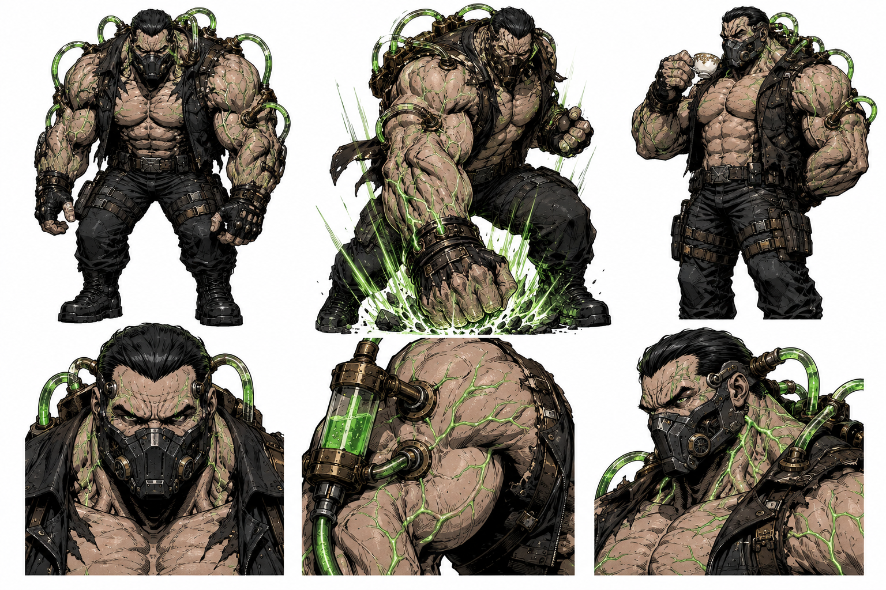

# 👿 Ficha de Diseño de Personaje: Gorgon (El Gigante de Metatoxina / Ejecutor Mutado)

* **Categoría:** Antagonista Secundario.
* **Origen:** Un colosal experimento físico sometido a cirugías invasivas por Phobos para instalarle puertos y mangueras, convirtiéndolo en el contenedor y ejecutor de su metatoxina verde.

* **Modus Operandi (El Experimento y Lacayo):**
    * **Estado Base (El Ejecutor):** Sin el químico en sus venas, es un gigante tosco, encorvado y pesado que actúa como un letal pero predecible ariete de fuerza bruta.
    * **Estado Alterado (El Intelecto):** Bajo la toxina, sus venas brillan de verde neón y sus músculos se expanden dramáticamente. Su intelecto se enciende, transformándolo en un ser hiperinteligente, sádico y refinado.

***

## 📊 Estadísticas y Atributos (Ficha Técnica)

* **Rol:** El Gigante de Metatoxina / Ejecutor Mutado
* **Fórmula de Combate / Stats (Estado Base):**
  * **Fuerza:** 10
  * **Inteligencia:** 4
  * **Carisma:** 5
  * **Suerte:** 5
  * **Combate:** 8
  * **Defensa:** 9
  * **Especial (Metatoxina):** 6
* **Crisis / Debilidad:** **Dualidad cognitiva:** En su estado base es predecible y tosco; en su estado alterado florece un intelecto refinado que odia su sumisión y planea rebelarse de Phobos.

***

## ⚡ Poderes y Habilidades Especiales (El Intelecto Mutado)

* **Significado Narrativo:** El titán cerebral. Una fuerza imparable cuyo mayor peligro no es la musculatura mutada, sino la mente calculadora que despierta el químico.
* **Estadísticas Amplificadas (Poderes Activos - Estado Alterado):**
  * **Fuerza:** 11 | **Inteligencia:** 10 | **Carisma:** 8 | **Suerte:** 6 | **Combate:** 9 | **Defensa:** 10 | **Especial:** 10
* **Crisis de Poder:** **Purga química:** Si se cortan o sabotean las mangueras de metatoxina, su sistema colapsa regresando a su estado base tosco y vulnerable.

### Habilidades:
1. **Carga de Toxina:** Bombea metatoxina verde para expandir su musculatura y encender su sistema nervioso.
2. **Hiperreflexia Refinada:** En estado mutado, predice trayectorias y diseña tácticas analíticas crueles en milisegundos.
3. **Embate Sísmico:** Descarga su colosal fuerza física amplificada contra el suelo para desestabilizar el entorno.

***

## 🎨 Aspecto y Estética Visual

* **Estética General:** Un gigante imponente de musculatura sobredimensionada, postura encorvada en su estado base y erguida/amenazante en su estado mutado. Lleva un respirador táctico pesado y un chaleco de cuero oscuro rasgado que permite ver los puertos implantados.
* **Mangueras Industriales:** Mangueras industriales conectadas directamente a su cabeza, cuello y brazos que bombean la brillante metatoxina verde a través de su cuerpo.
* **Brillo Green Neón:** Cuando la metatoxina se activa, sus venas y las mangueras brillan intensamente con un color verde neón fluorescente.

***

## 🖼️ Recursos Visuales

### Ilustración Ficha:

### Ilustración General (Cuerpo Completo):

