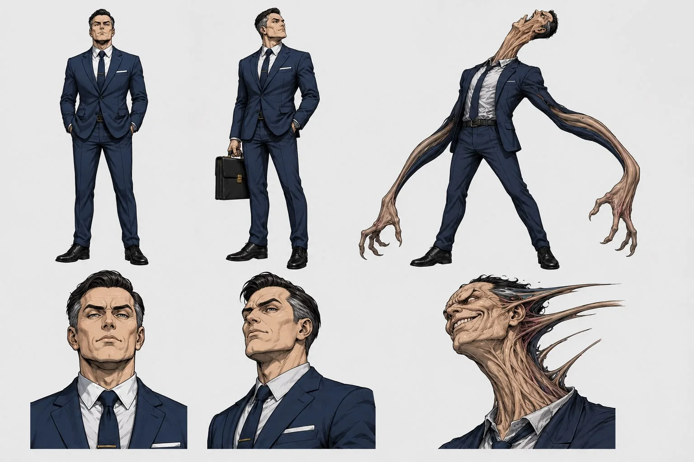
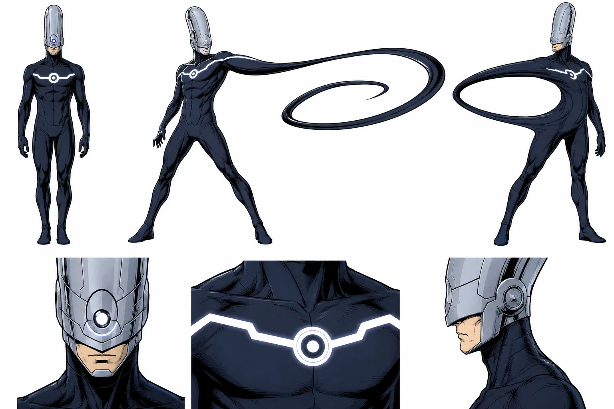
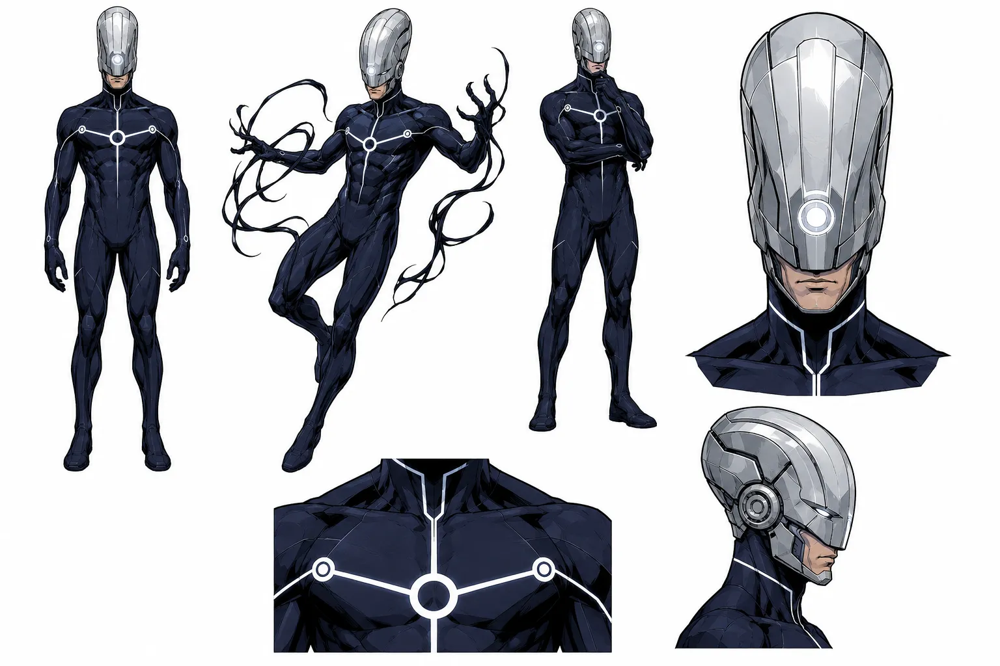

# 👿 Ficha de Diseño de Personaje: Maker (El Creador Elástico / Anomalía Mutante Científica)

* **Identidad Civil:** Norman Parker
* **Categoría:** Antagonista Principal / Anomalía Mutante Científica.
* **Origen:** Un antiguo genetista y magnate tecnológico obsesionado con la metatoxina de Phobos que experimentó en su propio cuerpo para "evolucionar". El resultado fue una mutación celular completa: su estructura anatómica se volvió completamente maleable, líquida y elástica. Ya no tiene huesos ni órganos fijos.

* **Relación con los Héroes:**
    * **Mentor Fallido de Ian:** Norman Parker intentó tutelar y reclutar a Ian en el pasado para que fuera su protegido y heredero intelectual. La firme brújula moral de Ian impidió que cayera bajo su influencia, rompiendo toda relación y convirtiendo su antigua mentoría en una profunda y tensa enemistad personal.

* **Modus Operandi (El Creador Elástico):**
    * **Elasticidad Anatómica:** Puede estirar, aplanar y contorsionar su cuerpo de formas físicamente imposibles para esquivar ataques o estrangular a distancia.
    * **Expansión Cerebral:** Su mutación le permite expandir su propia masa cerebral (estirando su cráneo o creando lóbulos temporales adicionales de carne), lo que le permite procesar información a la velocidad de una supercomputadora y predecir los ataques cinéticos o rúnicos de los chicos.
    * **Astucia Maquiavélica:** Fusión de Norman Osborn y Reed Richards. Es sumamente audaz e inteligente, capaz de orquestar planes malvados y salirse con la suya sin necesidad de utilizar sus habilidades elásticas directamente.

***

## 📊 Estadísticas y Atributos (Ficha Técnica)

* **Rol:** El Creador Elástico / Anomalía Mutante Científica
* **Fórmula de Combate / Stats:**
  * **Fuerza:** 6
  * **Inteligencia:** 10
  * **Carisma:** 6
  * **Suerte:** 5
  * **Combate:** 7
  * **Defensa:** 8
  * **Especial (Elasticidad Cerebral):** 9
* **Crisis / Debilidad:** **Inestabilidad térmica:** El calor extremo derrite su cohesión celular perdiendo toda forma, mientras que el frío extremo congela sus tejidos volviéndolos rígidos y sumamente frágiles.

***

## ⚡ Poderes y Habilidades Especiales (La Anomalía Biológica)

* **Significado Narrativo:** El intelectual mutable. Un villano pulcro, futurista y minimalista que combina elasticidad anatómica absoluta con un procesamiento cerebral a nivel de supercomputadora.
* **Estadísticas Amplificadas (Poderes Activos):**
  * **Fuerza:** 7 | **Inteligencia:** 11 | **Carisma:** 7 | **Suerte:** 5 | **Combate:** 9 | **Defensa:** 10 | **Especial:** 10
* **Crisis de Poder:** **Temperatura Extrema:** El calor intenso licúa su estructura celular perdiendo cohesión, mientras que el frío extremo cristaliza sus tejidos elásticos.

### Habilidades:
1. **Maleabilidad Anatómica:** Estira, aplana y contorsiona su cuerpo de formas físicamente imposibles para esquivar ataques o apresar objetivos a distancia.
2. **Expansión Cerebral:** Modifica la estructura de su cráneo para generar masa cerebral adicional, procesando datos a nivel de supercomputadora.
3. **Anatomía Líquida:** Carece de órganos y huesos fijos, lo que le permite regenerarse y deslizarse a través de espacios reducidos.

***

## 🎨 Aspecto y Estética Visual

* **Estética General:** Dejamos atrás cualquier rasgo de "monstruo mutante". Es un villano pulcro, futurista y minimalista. Un intelectual con un traje de polímero oscuro ceñido y un icónico casco alargado de alta tecnología que expande su capacidad cerebral y contiene su masa elástica de forma limpia y estética. En su faceta civil, viste trajes de sastre impecables de corte tecnológico futurista que ocultan por completo su naturaleza elástica y falta de estructura ósea.

***

## 🖼️ Recursos Visuales

### Ilustración Ficha Civil (Norman Parker):

### Ilustración Ficha de Villano (Maker):

### Ilustración Alternativa:

