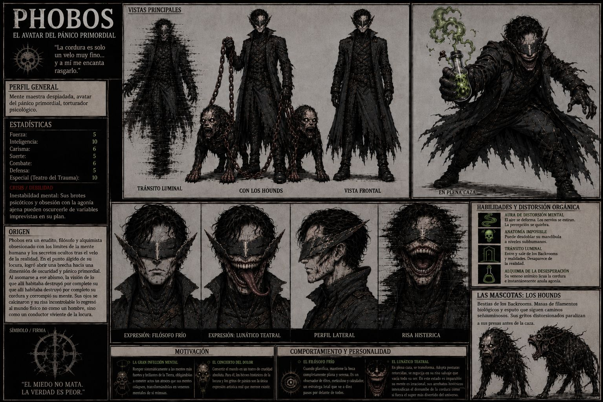

# 👿 Ficha de Diseño de Personaje: Phobos (El Arquitecto del Pánico)

* **Categoría:** Antagonista Principal / Mente Maestra Táctica.
* **Inspiración:** Thriller psicológico, horror industrial, privación sensorial táctica.

## 👤 Perfil General
"La moralidad es un error de cálculo... un límite artificial que yo ya he superado."

* **Arquetipo:** Genio táctico corrompido, depredador psicológico, estratega implacable libre de empatía.

***

## 📊 Estadísticas y Atributos (Ficha Técnica)

* **Rol:** Mente Maestra / Torturador Psicológico.
* **Fórmula de Combate / Stats:**
  * **Fuerza:** 6
  * **Inteligencia:** 10 (Genio absoluto y analítico)
  * **Carisma:** 6 (Manipulación fría)
  * **Suerte:** 5
  * **Combate:** 7 (Estilo militar y punzante)
  * **Defensa:** 6
  * **Especial (Geometría del Trauma):** 10
* **Crisis / Debilidad (Arrogancia Absoluta):** Su convicción de que la esperanza y la ética son fallas lógicas lo lleva a subestimar los sacrificios irracionales que los héroes están dispuestos a hacer por los demás.

***

## ⏳ Origen: El Proyecto "Phobos"
Originalmente, él era el estratega y científico militar más brillante del gobierno, encargado de desarrollar un suero experimental diseñado para suprimir el miedo y optimizar la eficiencia neuronal de los soldados en combate. En un accidente de laboratorio —o quizás en un acto de autosacrificio calculado—, se expuso voluntariamente al Compuesto Alfa original en su estado más puro y concentrado.

El químico no eliminó el miedo de su sistema; en su lugar, extirpó por completo su capacidad de sentir empatía, liberando un sadismo absoluto mientras dejaba su intelecto táctico intacto e hiperdesarrollado. Al ver el monstruo que habían creado, el gobierno clausuró el proyecto y selló los archivos, pero ya era tarde: el científico había muerto, y en su lugar nació Phobos, el Arquitecto del Pánico.

***

## ⚡ Habilidades y Control de Entorno
* **Aparato de Frecuencia de Risa:** Su risa maníaca no es solo un rasgo psicológico; está modulada por los implantes neurológicos y el daño del químico en sus cuerdas vocales. Emite una frecuencia acústica sutil que altera el sistema nervioso de quienes la escuchan, provocando náuseas, desorientación espacial y ataques de pánico involuntarios.
* **El Diseñador de Dilemas:** Su mayor habilidad es la guerra psicológica. Gracias a su mente militar, no ataca al azar; diseña escenarios y trampas donde sus objetivos se ven obligados a tomar decisiones éticamente devastadoras. Su sadismo radica en ver cómo la mente de sus presas se quiebra por pura lógica.
* **Tránsito Liminal:** Capaz de usar las esquinas y los espacios liminales de los Backrooms como un nexo táctico personal. Desaparece de la realidad tridimensional y reaparece de forma impredecible en los puntos ciegos de sus víctimas.
* **Estilo de Combate Purgante:** Cuando se ve forzado al combate físico, no pelea como un monstruo salvaje, sino con una precisión quirúrgica e industrial. Utiliza herramientas de restricción, cables de tensión pesados y hojas de aleación oscura.

***

## 🎨 Aspecto y Estética Visual
* **Aspecto Físico:** De una delgadez militar y rígida. Su piel tiene un tono pálido, ceniciento y artificial, como la porcelana agrietada. Su rostro permanece estático en una sonrisa tensa, fija y exagerada; una expresión de alegría maníaca que nunca llega a sus ojos y que resulta profundamente perturbadora.
* **Indumentaria (Estilo Táctico / Restricción):** Viste una gabardina larga de cuero negro balístico y pesado, reforzada con múltiples correas de sujeción, hebillas cromadas y un cuello alto rígido que enmarca su rostro. Evoca la estética de una camisa de fuerza militar de alta costura.
* **El Visor de Aleación:** Sobre sus sienes y cubriendo completamente sus ojos, lleva un visor angular de hierro oscuro pulido con pinchos geométricos agresivos. Esta pieza lo priva de la vista externa, obligándolo a guiar sus movimientos mediante la percepción táctica y el sonido.

***

## 👥 Las Mascotas: Los Hounds
Las dos figuras que Phobos arrastra rígidamente mediante pesadas cadenas de hierro oxidado son Hounds extraídos de las profundidades de los Backrooms:
* Son masas imponentes y biomecánicas compuestas por filamentos de cables negros y estructuras angulares que imitan la silueta de sabuesos semi-humanoides.
* Bajo sus órdenes directas, emiten silbidos industriales y alarmas distorsionadas que paralizan a los objetivos, cazando con una sincronización mecánica perfecta junto a su amo.

***

## 🎯 Motivación: ¿Qué es lo que busca?
* **La Ecuación de la Caída:** Romper sistemáticamente a los individuos más incorruptibles del mundo, demostrando a través de planes fríamente calculados que la moralidad es solo una debilidad de diseño.
* **El Teatro de la Crueldad:** Rediseñar la sociedad bajo sus propios términos. Para Phobos, el colapso del orden social y las risas histéricas de quienes pierden la cordura son el único estado de evolución lógica para la humanidad.

***

## 🎭 Comportamiento y Personalidad
* **El Monolito Frío:** Mientras planifica o da órdenes, es una figura de hielo. Mantiene una postura militar, rígida y silenciosa. Es el estratega perfecto que observa los acontecimientos desde las sombras, calculando cada variable física y psicológica.
* **El Verdugo Teatral:** Al ejecutar la fase final de su caza, su lenguaje corporal cambia. Adopta posturas ligeramente inclinadas, exageradas y fluidas. Su sonrisa fija se vuelve el centro de atención mientras desata su risa de frecuencia, disfrutando de la caída de su presa con la satisfacción de un artista que ve terminada su obra maestra.

***

## 🖼️ Recursos Visuales

### Ilustración Ficha:

### Ilustración General (Cuerpo Completo):

### Versión Alternativa:
