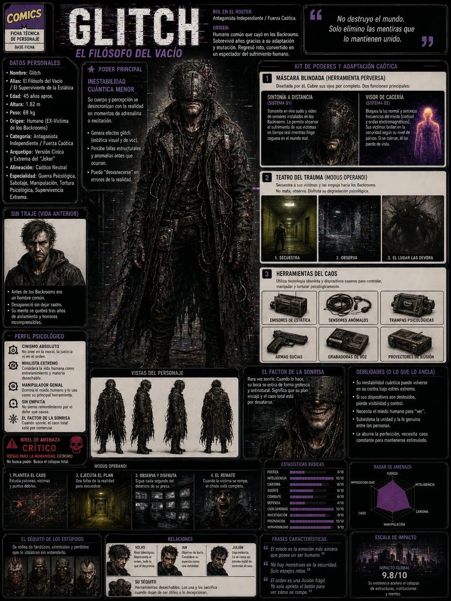

# 👿 Comandante R.E.G.U.L.A.R.

*   **Categoría:** Antagonista / Fuerza Militar.
*   **Origen:** Comandante a cargo del Escuadrón de Contención Regular, un grupo militar de élite entrenado para suprimir anomalías.
*   **Poder Principal:** *Anulación de Poderes (Campo de Supresión).*
    *   Genera campos electromagnéticos portátiles que anulan las habilidades rúnicas, cinéticas o de intercambio en su cercanía, obligando a los personajes a luchar en términos puramente humanos.
*   **Estética Visual:** Traje blindado militar táctico gris pesado, visor de contención con luz roja y rifles de supresión de plasma.

---

## 🖼️ Recursos Visuales

### Ilustración General:
![Comandante REGULAR]../../../../public/personajes/Antagonistas/REGULAR/REGULAR.webp)
# 🎨 Arte y Prompts Visuales de Comandante REGULAR

## 📝 Plantilla de Prompt de Apariencia (Inglés)

*   **Aspecto:** `futuristic military police captain in heavy black armor, a solid glowing blue visor covering the entire face, holding a tactical rifle that fires blue energy webs, body partially glitching in green digital scan lines.`

# 👿 Don Vanguard (El Protector de Vought)

*   **Categoría:** Antagonista Principal.
*   **Origen:** El comandante y líder supremo de las fuerzas de defensa de Vought. Es un líder militar implacable dispuesto a aplastar cualquier anomalía multiversal que amenace el orden corporativo.
*   **Poder Principal:** *Manipulación de Escudo y Fuerza Táctica.*
    *   Empuña un gran escudo blindado de tecnología Vought y posee fuerza física sobrehumana y resistencia masiva de grado militar.
*   **Estética Visual:** Traje blindado de gala militar negro y dorado, capa corta y un escudo dorado de alta tecnología.

---

## 🖼️ Recursos Visuales

### Ilustración General:
![Don Vanguard]../../../../public/personajes/Antagonistas/DON/Vanguard.webp)

### Ficha de Personaje:
![Don Vanguard Ficha]../../../../public/personajes/Antagonistas/DON/Vanguard_ficha.webp)
# 🎨 Arte y Prompts Visuales de Don Vanguard

## 📝 Plantilla de Prompt de Apariencia (Inglés)

*   **Aspecto:** `A massive two-meter-tall corporate kingpin (Don Vanguard) under a tailored three-piece Oxford grey suit, wearing a black diamond ring.`

---

# 👿 Phobos (El Ventrílocuo de los Backrooms)

*   **Categoría:** Antagonista Principal / Mente Maquiavélica.
*   **Origen:** Anteriormente conocido como Glitch. Manipulador absoluto que opera desde la sombra de los Backrooms, obsesionado con diseñar el "Teatro del Trauma" para quebrar psicológicamente a sus presas.
*   **Poder Principal:** *Estática Analógica y Control de Frecuencia.*
*   **Estética Visual:** Visera ciega de metal y cuero remachado con cables expuestos hacia atrás, gabardina larga de lona negra desgastada, postura teatral y una sonrisa grotesca desfigurada.

---

## 🖼️ Recursos Visuales

### Ilustración General (Turnaround):

### Ficha de Personaje:

---

# 👿 Gorgon (El Gigante de Metatoxina)

*   **Categoría:** Antagonista Secundario / Fuerza Bruta Inteligente.
*   **Origen:** Experimento humano de Phobos. Sometido a cirugías invasivas para instalarle puertos y mangueras con metatoxina verde en cabeza, espalda y brazos.
*   **Poder Principal:** *Dualidad Cognitiva (Fuerza Colosal / Intelecto Mutado).*
*   **Estética Visual:** Titán de musculatura masiva, chaleco de cuero oscuro rasgado, pantalones tácticos y botas militares. Cabellera oscura peinada hacia atrás y un respirador táctico pesado permanente sobre su boca.

---

## 🖼️ Recursos Visuales

### Ilustración General (Sheet Guide):

### Ficha de Personaje:

